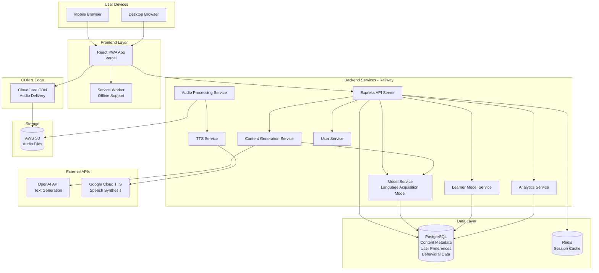
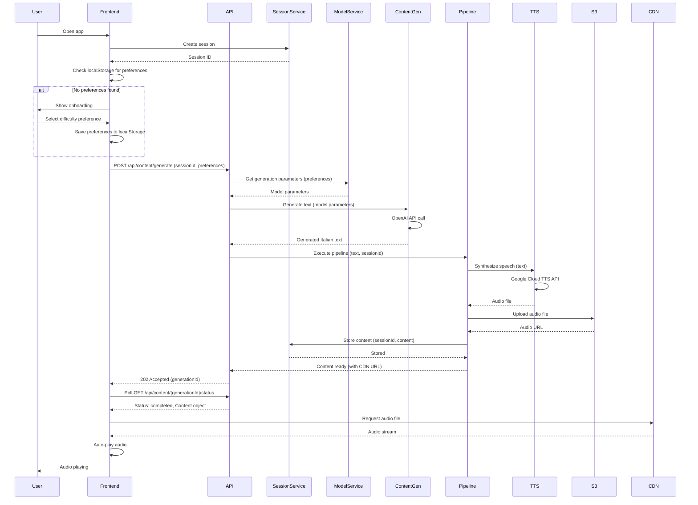
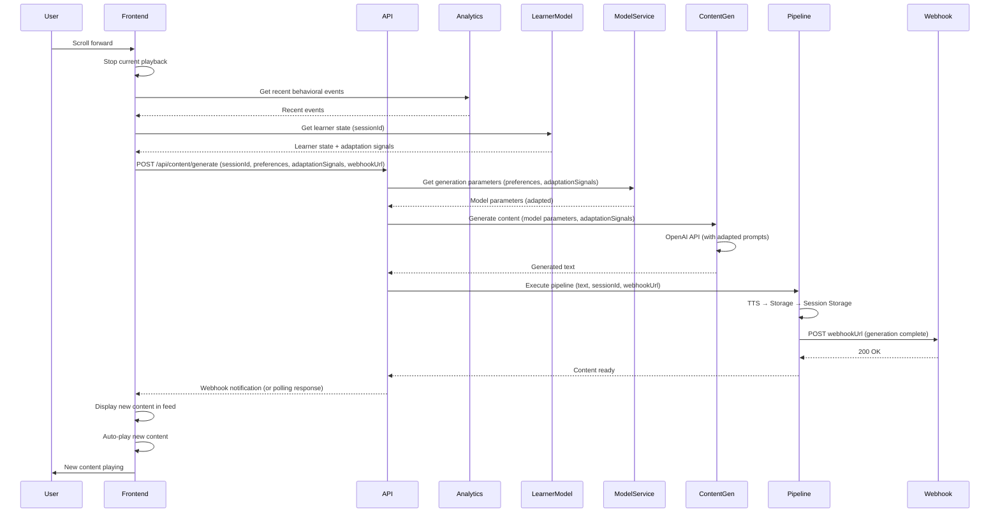
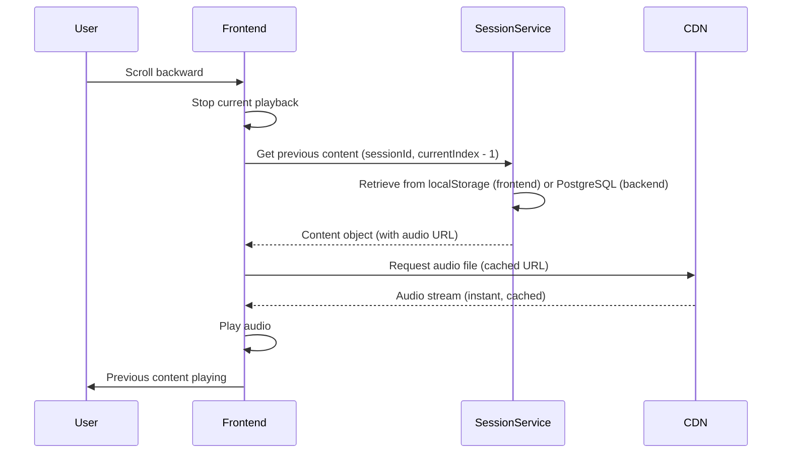
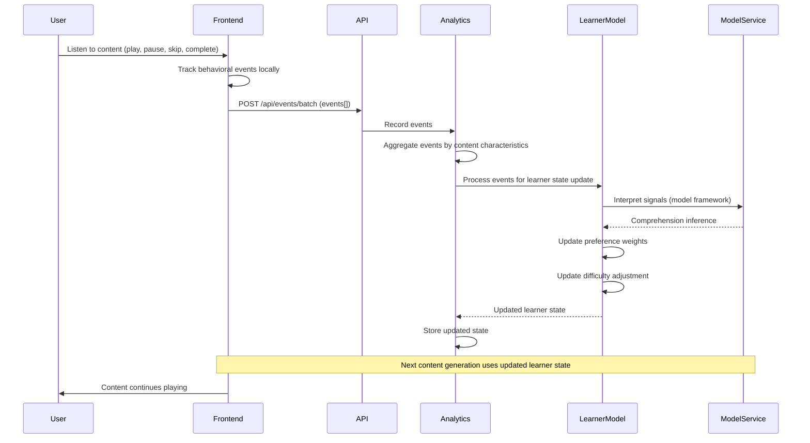
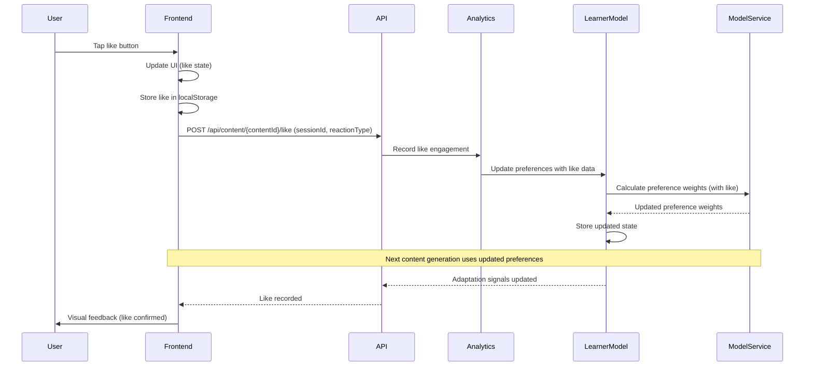
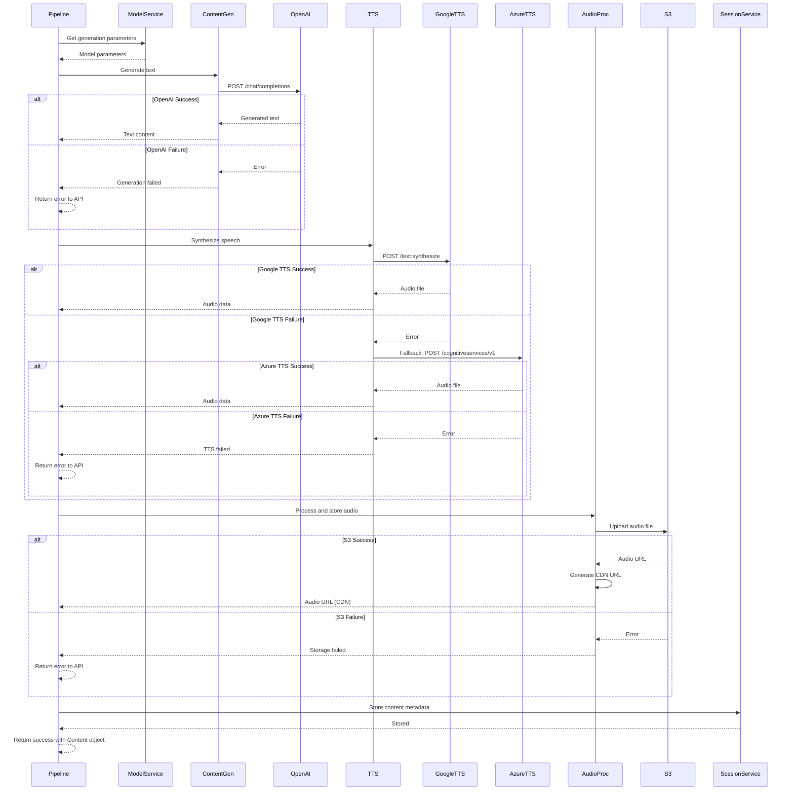

# Adaptive Italian Audio for Accelerated Acquisition - Fullstack Architecture Document

**Document Version:** 1.0  
**Date:** 2026-01-07  
**Status:** Draft  
**Based on:** PRD v2 (sharded)

---

## Introduction

This document outlines the complete fullstack architecture for Adaptive Italian Audio for Accelerated Acquisition, including backend systems, frontend implementation, and their integration. It serves as the single source of truth for AI-driven development, ensuring consistency across the entire technology stack.

This unified approach combines what would traditionally be separate backend and frontend architecture documents, streamlining the development process for modern fullstack applications where these concerns are increasingly intertwined.

### Starter Template or Existing Project

**Status:** Greenfield project - Turborepo monorepo structure

**Decision:** Use Turborepo as the monorepo tooling framework.

**Rationale:**
- Optimal balance of performance (intelligent caching), simplicity, and scalability
- Strong TypeScript support aligns with project requirements
- Low learning curve for both developers and AI agents
- Excellent performance for build and development workflows
- Scales well as the project grows (frontend, backend, model service)

**Structure to Establish:**
- Monorepo structure using Turborepo
- Frontend: React + TypeScript + Tailwind CSS
- Backend: Node.js + Express + TypeScript
- Model Service: TypeScript/JavaScript implementation (computationally efficient, no GPU requirements)
- Shared packages for common types and utilities

### Change Log

| Date | Version | Description | Author |
|------|---------|-------------|--------|
| 2026-01-07 | 1.0 | Initial architecture document based on PRD v2 | Architect |

---

## High Level Architecture

### Technical Summary

The Adaptive Italian Audio application is built as a modular monolith using a Turborepo monorepo structure, optimized for rapid development and future scalability. The frontend is a React-based Progressive Web App (PWA) with TypeScript and Tailwind CSS, designed for mobile-first responsive consumption. The backend consists of Node.js/Express services with TypeScript, including a centralized Model Service that operationalizes the foundation language acquisition model. The system integrates with external AI APIs (OpenAI for text generation, Google Cloud TTS for audio conversion) and uses PostgreSQL for structured data storage with Redis for session caching. The architecture supports asynchronous content generation pipelines, real-time behavioral tracking, and model-driven adaptation logic. Deployment uses a modern cloud platform (Vercel for frontend, Railway/Render for backend) with cloud storage (AWS S3 or Google Cloud Storage) for audio files and CDN delivery. The system is designed to operate within free-tier API limits for MVP scale while supporting model-driven content generation, adaptation, and measurement throughout.

### Platform and Infrastructure Choice

**Analysis of Options:**

Based on PRD v2 requirements, we need:
- Frontend hosting with PWA support
- Backend API hosting
- PostgreSQL database
- Cloud storage for audio files
- CDN for audio delivery
- Cost-effective for MVP (free-tier considerations)

**Option 1: Vercel + Railway/Render (Recommended)**
- **Frontend:** Vercel (optimized for React, automatic deployments, edge functions)
- **Backend:** Railway or Render (simple Node.js deployment, managed PostgreSQL)
- **Storage:** AWS S3 or Google Cloud Storage
- **CDN:** CloudFlare or Vercel Edge Network
- **Pros:** 
  - Excellent developer experience
  - Fast deployments
  - Good free tiers
  - Vercel optimized for React/Next.js
- **Cons:**
  - Multiple platforms to manage
  - Potential vendor lock-in

**Option 2: AWS Full Stack**
- **Frontend:** AWS Amplify or S3 + CloudFront
- **Backend:** AWS Lambda + API Gateway
- **Database:** RDS PostgreSQL
- **Storage:** S3
- **CDN:** CloudFront
- **Pros:**
  - Unified platform
  - Enterprise-grade scalability
  - Comprehensive services
- **Cons:**
  - More complex setup
  - Higher learning curve
  - More expensive for MVP

**Option 3: Google Cloud Platform**
- **Frontend:** Firebase Hosting or Cloud Run
- **Backend:** Cloud Run or Cloud Functions
- **Database:** Cloud SQL (PostgreSQL)
- **Storage:** Cloud Storage
- **CDN:** Cloud CDN
- **Pros:**
  - Good for ML/AI workloads (if we expand model service)
  - Integrated TTS service
- **Cons:**
  - More complex than needed for MVP
  - Higher setup overhead

**Recommendation:** **Option 1 - Vercel + Railway/Render**

**Rationale:**
- Best developer experience for rapid MVP development
- Vercel's React optimization aligns with frontend stack
- Railway/Render provide simple backend deployment with managed PostgreSQL
- Cost-effective free tiers suitable for MVP scale
- Easy to migrate to other platforms later if needed
- Separate concerns allow optimization per layer

**Selected Platform Configuration:**
- **Platform:** Vercel (Frontend) + Railway (Backend) ✓ **CONFIRMED**
- **Key Services:** 
  - Vercel: Frontend hosting, edge functions
  - Railway: Backend API, managed PostgreSQL, Redis
  - AWS S3: Audio file storage
  - CloudFlare: CDN for audio delivery
- **Deployment Host and Regions:** US-East (primary), with CDN for global distribution

### User Responsibilities & Setup Requirements

**CRITICAL:** The following setup tasks must be completed by the user before development can begin. These cannot be automated by development agents.

**External Service Account Creation (Required Before Epic 1):**

1. **OpenAI API Account Setup:**
   - Create OpenAI account at https://platform.openai.com
   - Generate API key from account settings
   - Store API key securely for environment variable configuration
   - Verify API key has access to GPT-3.5-turbo and GPT-4 models
   - **User Action Required:** Account creation and API key generation

2. **Google Cloud TTS Service Setup:**
   - Create Google Cloud Platform account (or use existing)
   - Enable Text-to-Speech API in Google Cloud Console
   - Create service account for TTS API access
   - Generate service account JSON key file
   - Store JSON key file path for environment variable configuration
   - **User Action Required:** Account creation, API enablement, service account setup

3. **AWS S3 Storage Setup:**
   - Create AWS account (or use existing)
   - Create S3 bucket for audio file storage
   - Configure bucket policy for public read access (CDN access)
   - Create IAM user with S3 read/write permissions
   - Generate AWS Access Key ID and Secret Access Key
   - Store credentials securely for environment variable configuration
   - **User Action Required:** Account creation, bucket creation, IAM setup, credential generation

4. **CloudFlare CDN Setup (Post-Deployment):**
   - Create CloudFlare account (or use existing)
   - Add domain for CDN distribution
   - Configure S3 bucket as origin
   - Configure caching rules for audio files
   - **User Action Required:** Account creation, domain configuration, CDN setup

**Documentation Location:**
- Setup instructions for external services should be documented in project README.md
- Environment variable templates provided in `.env.example`
- Configuration guide in project documentation

**Rationale:**
External service account creation requires user authentication, payment setup, and service-specific configuration that cannot be automated by development agents. These must be completed by the user before any content generation or deployment workflows can function.

### Repository Structure

**Structure:** Monorepo using Turborepo

**Monorepo Tool:** Turborepo

**Package Organization:**
```
adaptive-italian-audio/
├── apps/
│   ├── web/                    # React frontend application
│   └── api/                    # Node.js/Express backend
├── packages/
│   ├── shared/                 # Shared TypeScript types and utilities
│   ├── model-service/          # Foundation language acquisition model service
│   └── config/                 # Shared configs (ESLint, TypeScript, etc.)
├── infrastructure/             # IaC definitions (if needed)
├── docs/                       # Documentation
└── turbo.json                  # Turborepo configuration
```

**Rationale:**
- Clear separation between frontend (apps/web) and backend (apps/api)
- Model service as separate package enables independent development and testing
- Shared package for common types ensures type safety across boundaries
- Config package centralizes tooling configuration
- Turborepo handles build orchestration and caching automatically

### High Level Architecture Diagram



### Architectural Patterns

- **Modular Monolith:** Service-oriented architecture within a single deployable unit, with clear service boundaries that can evolve into microservices if scaling demands it - _Rationale:_ Simplifies MVP development while maintaining separation of concerns, enables future migration path without refactoring

- **Progressive Web App (PWA):** Web application with service worker for offline capabilities and app-like experience - _Rationale:_ Supports lean-back mobile consumption, enables offline playback of cached content, provides native app-like experience without app store distribution

- **Model-Driven Architecture:** Centralized Model Service operationalizes foundation language acquisition model principles throughout the system - _Rationale:_ Ensures consistent application of model principles in content generation, adaptation, and measurement, enables model validation and refinement

- **Event-Driven Content Generation:** Asynchronous pipeline for content generation (text → TTS → storage) triggered by user scroll actions - _Rationale:_ Non-blocking user experience, supports on-demand generation, enables queue-based processing for API rate limit management

- **Repository Pattern:** Abstract data access layer separating business logic from database implementation - _Rationale:_ Enables testing with mock repositories, supports future database migration flexibility, maintains clean service boundaries

- **Session-Based State Management:** Frontend state management using React Context API with localStorage persistence - _Rationale:_ Lightweight for MVP, supports offline-first approach, enables session-based content navigation without backend complexity

- **Behavioral Signal Collection:** Passive event tracking system that collects user interaction data without explicit feedback - _Rationale:_ Aligns with model's emphasis on naturalistic measurement, enables model-driven adaptation without interrupting lean-back experience

- **Model-Informed Adaptation:** Content selection and difficulty adjustment driven by Model Service predictions based on behavioral signals - _Rationale:_ Operationalizes foundation model's adaptation principles, enables automatic personalization without manual configuration

---

## Tech Stack

This is the **DEFINITIVE** technology selection for the entire project. All development must use these exact versions and technologies.

### Technology Stack Table

| Category | Technology | Version | Purpose | Rationale |
|----------|------------|---------|---------|-----------|
| Frontend Language | TypeScript | 5.x | Type-safe frontend development | Ensures type safety across frontend codebase, aligns with PRD requirement |
| Frontend Framework | React | 18.x | UI component framework | Industry standard, excellent ecosystem, aligns with PRD requirement |
| UI Component Library | None (Custom) | - | Custom components with Tailwind | PRD specifies minimal UI, custom components provide full control |
| State Management | React Context API | Built-in | Client-side state management | Lightweight for MVP, no external dependencies, aligns with PRD requirement |
| Backend Language | TypeScript | 5.x | Type-safe backend development | Ensures type safety across backend, shared types with frontend |
| Backend Framework | Express | 4.x | RESTful API server | Industry standard, simple, aligns with PRD requirement |
| API Style | REST | - | HTTP-based API communication | Simple, well-understood, aligns with PRD technical assumptions |
| Database | PostgreSQL | 15+ | Structured data storage | Relational data for content metadata, user preferences, behavioral tracking |
| Cache | Redis | 7.x | Session caching and temporary data | Fast session storage, supports real-time adaptation logic |
| File Storage | AWS S3 | - | Audio file storage | Scalable, cost-effective, CDN integration |
| Authentication | None (MVP) | - | Deferred to post-MVP | PRD specifies authentication deferred, localStorage for MVP |
| Frontend Testing | Vitest + React Testing Library | Latest | Unit and component testing | Fast, modern, excellent React support |
| Backend Testing | Vitest + Supertest | Latest | API and service testing | Consistent testing framework across stack |
| E2E Testing | Playwright | Latest | End-to-end testing | Reliable, cross-browser, supports PWA testing |
| Build Tool | Turborepo | Latest | Monorepo build orchestration | Fast builds with intelligent caching, aligns with architecture decision |
| Bundler | Vite | Latest | Frontend bundling | Fast dev server, optimized production builds |
| IaC Tool | None (MVP) | - | Infrastructure as Code | Deferred - using managed services (Vercel, Railway) |
| CI/CD | GitHub Actions | - | Continuous integration/deployment | Integrated with GitHub, free for public repos |
| Monitoring | Vercel Analytics + Custom | - | Performance and error tracking | Vercel provides built-in analytics, custom for behavioral tracking |
| Logging | Winston + Pino | Latest | Structured logging | Backend logging, supports model validation tracking |
| CSS Framework | Tailwind CSS | 3.x | Utility-first CSS framework | Rapid UI development, aligns with PRD requirement |

### Additional Technology Decisions

**Text-to-Speech:**
- **Primary:** Google Cloud TTS API
- **Fallback:** Azure Cognitive Services TTS
- **Rationale:** PRD specifies Google Cloud TTS as primary with Azure fallback for reliability

**Text Generation:**
- **Primary:** OpenAI GPT-4 or GPT-3.5-turbo
- **Rationale:** PRD specifies OpenAI for Italian content generation, GPT-3.5-turbo for cost efficiency, GPT-4 for quality when needed

**Audio Processing:**
- **Format:** MP3 (128kbps recommended)
- **Rationale:** Good balance of quality and file size for language learning content

**PWA Support:**
- **Service Worker:** Workbox or custom
- **Manifest:** Web App Manifest
- **Rationale:** PRD requires PWA capabilities for offline playback and app-like experience

**Package Manager:**
- **Tool:** pnpm
- **Rationale:** Better monorepo performance, reduced disk usage, faster installs. Required for consistency across development workflows.

---

## Data Models

Core data models/entities shared between frontend and backend. These TypeScript interfaces will be defined in `packages/shared` for type safety across the entire stack.

### Content

**Purpose:** Represents generated Italian audio content (episodes, narratives, podcasts, educational content) with all metadata needed for playback, adaptation, and model validation. Includes comprehensive metadata for post-MVP features.

**Key Attributes:**
- `id`: string - Unique content identifier
- `title`: string - Content title/name
- `description`: string | null - Content description/summary (post-MVP)
- `textContent`: string - Original generated Italian text
- `audioUrl`: string - URL to audio file (S3/CDN)
- `audioFormat`: 'mp3' | 'ogg' | 'wav' - Audio file format
- `audioBitrate`: number - Audio bitrate in kbps
- `audioSize`: number - Audio file size in bytes
- `format`: 'narrative' | 'podcast' | 'educational' - Content format type
- `genre`: string | null - Narrative genre (if narrative format)
- `subGenre`: string | null - Sub-genre classification (post-MVP)
- `topic`: string | null - Content topic/subject matter
- `tags`: string[] - Content tags for categorization and search (post-MVP)
- `templateId`: string - Template identifier used for generation
- `templateVersion`: string - Template version for tracking
- `difficulty`: 'lexical-heavy' | 'discourse-heavy' - Model-informed difficulty level
- `difficultyScore`: number - Numeric difficulty score (0-1, post-MVP)
- `estimatedComprehensionLevel`: string | null - Model-estimated comprehension level needed (post-MVP)
- `duration`: number - Audio duration in seconds
- `wordCount`: number - Approximate word count in text
- `modelParameters`: ModelParameters - Model service parameters used for generation
- `generatedAt`: Date - Generation timestamp
- `generatedBy`: string - Generation service/version identifier
- `sessionId`: string - Session identifier for backward navigation
- `episodeNumber`: number | null - Episode number (for serial narratives)
- `seriesId`: string | null - Series identifier for grouping episodes (post-MVP)
- `continuityContext`: string | null - Narrative continuity context from previous episodes
- `relatedContentIds`: string[] - Related content identifiers (post-MVP)
- `language`: string - Language code (default: 'it' for Italian)
- `locale`: string | null - Regional variant (e.g., 'it-IT', 'it-CH', post-MVP)
- `qualityScore`: number | null - Content quality score from validation (post-MVP)
- `engagementMetrics`: EngagementMetrics | null - Aggregated engagement data (post-MVP)
- `metadata`: Record<string, any> - Flexible metadata for future extensions

**TypeScript Interface:**
```typescript
interface Content {
  id: string;
  title: string;
  description: string | null;
  textContent: string;
  audioUrl: string;
  audioFormat: 'mp3' | 'ogg' | 'wav';
  audioBitrate: number;
  audioSize: number;
  format: 'narrative' | 'podcast' | 'educational';
  genre: string | null;
  subGenre: string | null;
  topic: string | null;
  tags: string[];
  templateId: string;
  templateVersion: string;
  difficulty: 'lexical-heavy' | 'discourse-heavy';
  difficultyScore: number;
  estimatedComprehensionLevel: string | null;
  duration: number;
  wordCount: number;
  modelParameters: ModelParameters;
  generatedAt: Date;
  generatedBy: string;
  sessionId: string;
  episodeNumber: number | null;
  seriesId: string | null;
  continuityContext: string | null;
  relatedContentIds: string[];
  language: string;
  locale: string | null;
  qualityScore: number | null;
  engagementMetrics: EngagementMetrics | null;
  metadata: Record<string, any>;
}

interface ModelParameters {
  lexicalNoveltyBudget: number;
  constructionSets: string[];
  variationPattern: string;
  comprehensibilityTarget: number;
  semanticStability: number;
  discourseComplexity?: number; // post-MVP
  vocabularyLevel?: string; // post-MVP
  grammarComplexity?: number; // post-MVP
}

interface EngagementMetrics {
  totalPlays: number;
  totalCompletions: number;
  averageCompletionRate: number;
  averageListeningDuration: number;
  likeCount: number;
  skipRate: number;
  replayRate: number;
  lastEngagedAt: Date | null;
}
```

**Relationships:**
- One Content can have many BehavioralEvents (listening behavior tracked)
- One Content can have one LikeEngagement (user like status)
- Many Content items belong to one Session (session-based organization)
- One Content can reference many related Content items (via relatedContentIds, post-MVP)
- Many Content items can belong to one Series (via seriesId, post-MVP)
- **Note:** User model deferred to post-MVP authentication phase

### User Preferences

**Purpose:** Stores user preferences for difficulty, content format preferences, and other settings. Persisted in localStorage for MVP, designed for future database migration.

**Key Attributes:**
- `difficultyPreference`: 'beginner' | 'intermediate' | 'advanced' - User-selected difficulty
- `preferredFormats`: ('narrative' | 'podcast' | 'educational')[] - Format preferences
- `preferredGenres`: string[] - Genre preferences (for narratives)
- `playbackSpeed`: number - Audio playback speed multiplier (default: 1.0)
- `autoPlay`: boolean - Auto-play on content load
- `lastUpdated`: Date - Last preference update timestamp
- `version`: number - Data structure version for migration

**TypeScript Interface:**
```typescript
interface UserPreferences {
  difficultyPreference: 'beginner' | 'intermediate' | 'advanced';
  preferredFormats: ('narrative' | 'podcast' | 'educational')[];
  preferredGenres: string[];
  playbackSpeed: number;
  autoPlay: boolean;
  lastUpdated: Date;
  version: number;
}
```

**Relationships:**
- One UserPreferences influences many Content generation requests (preferences passed to model service)
- One UserPreferences influences LearnerModelState (preferences inform baseline learner state)

### Behavioral Event

**Purpose:** Tracks passive user listening behavior according to the foundation model's measurement framework. Collected in real-time during playback. Designed to be comprehensive and post-MVP ready.

**Key Attributes:**
- `id`: string - Unique event identifier
- `contentId`: string - Associated content identifier
- `eventType`: BehavioralEventType - Granular event type classification
- `timestamp`: Date - Event timestamp (millisecond precision)
- `playbackPosition`: number - Playback position in seconds at event time
- `playbackPositionPercent`: number - Playback position as percentage (0-100)
- `duration`: number - Event duration in seconds (for pause, replay events)
- `sessionId`: string - Session identifier
- `contentCharacteristics`: ContentCharacteristics - Content metadata for pattern analysis
- `deviceInfo`: DeviceInfo | null - Device/browser information (post-MVP)
- `networkType`: string | null - Network connection type (post-MVP)
- `context`: EventContext - Additional context about the event

**TypeScript Interface:**
```typescript
interface BehavioralEvent {
  id: string;
  contentId: string;
  eventType: BehavioralEventType;
  timestamp: Date;
  playbackPosition: number;
  playbackPositionPercent: number;
  duration: number;
  sessionId: string;
  contentCharacteristics: ContentCharacteristics;
  deviceInfo: DeviceInfo | null;
  networkType: string | null;
  context: EventContext;
}

type BehavioralEventType =
  // Playback control events
  | 'play'
  | 'pause'
  | 'resume'
  | 'stop'
  // Navigation events
  | 'skip-forward'
  | 'skip-backward'
  | 'seek-forward'
  | 'seek-backward'
  | 'seek-to-position'
  // Replay events
  | 'replay-segment'
  | 'replay-full'
  | 'replay-from-position'
  // Completion events
  | 'complete'
  | 'complete-with-replay'
  | 'abandon'
  | 'abandon-early' // < 25% completion
  | 'abandon-mid' // 25-75% completion
  | 'abandon-late' // > 75% completion
  // Engagement events
  | 'like'
  | 'unlike'
  | 'share' // post-MVP
  | 'bookmark' // post-MVP
  // Quality/technical events
  | 'buffering-start'
  | 'buffering-end'
  | 'error-audio-load'
  | 'error-playback'
  | 'quality-change' // post-MVP
  // Interaction events
  | 'speed-change'
  | 'volume-change'
  | 'background-play' // App in background
  | 'foreground-play' // App in foreground
  // Model validation events
  | 'comprehension-report' // post-MVP explicit feedback
  | 'difficulty-feedback'; // post-MVP explicit feedback

interface EventContext {
  previousEventType?: BehavioralEventType;
  timeSinceLastEvent?: number;
  consecutiveSkips?: number;
  totalReplays?: number;
  playbackSpeed?: number;
  volumeLevel?: number;
}

interface DeviceInfo {
  userAgent: string;
  platform: string;
  screenWidth: number;
  screenHeight: number;
  isMobile: boolean;
  isTablet: boolean;
}

interface ContentCharacteristics {
  format: string;
  genre: string | null;
  difficulty: string;
  templateId: string;
  topic?: string | null; // post-MVP
  tags?: string[]; // post-MVP
}
```

**Relationships:**
- Many BehavioralEvents belong to one Content (multiple events per content item)
- Many BehavioralEvents belong to one Session (session-based tracking)
- BehavioralEvents inform LearnerModelState (signals processed for comprehension inference)

### Like Engagement

**Purpose:** Tracks user likes (Instagram-style) for content items. Quick engagement feedback that informs model-driven adaptation. Extended for post-MVP features.

**Key Attributes:**
- `contentId`: string - Associated content identifier
- `liked`: boolean - Like status
- `likedAt`: Date | null - Like timestamp
- `unlikedAt`: Date | null - Unlike timestamp (post-MVP)
- `sessionId`: string - Session identifier
- `contentCharacteristics`: ContentCharacteristics - Content metadata for pattern analysis
- `reactionType`: 'like' | 'love' | 'favorite' | null - Extended reaction types (post-MVP)

**TypeScript Interface:**
```typescript
interface LikeEngagement {
  contentId: string;
  liked: boolean;
  likedAt: Date | null;
  unlikedAt: Date | null;
  sessionId: string;
  contentCharacteristics: ContentCharacteristics;
  reactionType: 'like' | 'love' | 'favorite' | null;
}
```

**Relationships:**
- One LikeEngagement belongs to one Content (one like status per content)
- LikeEngagement informs LearnerModelState (likes influence preference weights)

### Learner Model State

**Purpose:** Represents inferred user comprehension and preferences based on behavioral signals and model principles. Maintained by Model Service according to foundation model's learner state representation.

**Key Attributes:**
- `preferenceWeights`: PreferenceWeights - Model-inferred preference scores
- `comprehensionLevel`: number - Inferred comprehension level (0-1 scale)
- `contentTypePreferences`: ContentTypePreferences - Format/genre preference scores
- `difficultyAdjustment`: number - Model-calculated difficulty adjustment
- `lastUpdated`: Date - Last model update timestamp
- `dataPoints`: number - Number of behavioral signals processed

**TypeScript Interface:**
```typescript
interface LearnerModelState {
  preferenceWeights: PreferenceWeights;
  comprehensionLevel: number;
  contentTypePreferences: ContentTypePreferences;
  difficultyAdjustment: number;
  lastUpdated: Date;
  dataPoints: number;
}

interface PreferenceWeights {
  narrative: number;
  podcast: number;
  educational: number;
  [genre: string]: number;
}

interface ContentTypePreferences {
  formatScores: Record<string, number>;
  genreScores: Record<string, number>;
  difficultyScores: Record<string, number>;
}
```

**Relationships:**
- LearnerModelState is informed by many BehavioralEvents (signals processed)
- LearnerModelState is informed by many LikeEngagement items (likes influence preferences)
- LearnerModelState influences Content generation (adaptation decisions)

### Session

**Purpose:** Tracks user sessions for content organization and backward navigation. Session-based content storage enables scrolling backward through session history.

**Key Attributes:**
- `id`: string - Unique session identifier
- `startedAt`: Date - Session start timestamp
- `lastActivityAt`: Date - Last activity timestamp
- `contentIds`: string[] - Ordered list of content IDs in session
- `currentContentId`: string | null - Currently playing content
- `totalListeningTime`: number - Total listening time in seconds

**TypeScript Interface:**
```typescript
interface Session {
  id: string;
  startedAt: Date;
  lastActivityAt: Date;
  contentIds: string[];
  currentContentId: string | null;
  totalListeningTime: number;
}
```

**Relationships:**
- One Session contains many Content items (session-based content organization)
- One Session has many BehavioralEvents (events tracked per session)
- One Session has many LikeEngagement items (likes tracked per session)

---

## API Specification

REST API specification using OpenAPI 3.0. All endpoints follow RESTful conventions with JSON request/response bodies.

### REST API Specification

```yaml
openapi: 3.0.0
info:
  title: Adaptive Italian Audio API
  version: 1.0.0
  description: REST API for Adaptive Italian Audio application. Supports model-driven content generation, behavioral tracking, and adaptation.
servers:
  - url: https://api.adaptive-italian-audio.railway.app
    description: Production server
  - url: http://localhost:3001
    description: Local development server

paths:
  # Content Generation Endpoints
  /api/content/generate:
    post:
      summary: Generate new Italian audio content
      description: Triggers model-driven content generation pipeline. Returns generation status immediately, content available via polling or webhook notification.
      operationId: generateContent
      requestBody:
        required: true
        content:
          application/json:
            schema:
              type: object
              required:
                - sessionId
              properties:
                sessionId:
                  type: string
                  description: Current session identifier
                webhookUrl:
                  type: string
                  format: uri
                  description: Optional webhook URL for generation completion notification
                userPreferences:
                  $ref: '#/components/schemas/UserPreferences'
                adaptationSignals:
                  type: object
                  description: Model-driven adaptation signals from learner model
                  properties:
                    preferredFormats:
                      type: array
                      items:
                        type: string
                        enum: [narrative, podcast, educational]
                    preferredGenres:
                      type: array
                      items:
                        type: string
                    difficultyAdjustment:
                      type: number
                      description: Model-calculated difficulty adjustment
                continuityContext:
                  type: object
                  description: Previous episode context for serial narratives
                  properties:
                    previousEpisodeId:
                      type: string
                    episodeNumber:
                      type: number
                    storylineContext:
                      type: string
      responses:
        '202':
          description: Content generation initiated
          content:
            application/json:
              schema:
                type: object
                properties:
                  generationId:
                    type: string
                  status:
                    type: string
                    enum: [generating, processing, completed, failed]
                  estimatedCompletionTime:
                    type: number
                    description: Estimated seconds until completion
                  webhookRegistered:
                    type: boolean
                    description: Whether webhook notification will be sent
        '400':
          $ref: '#/components/responses/BadRequest'
        '429':
          $ref: '#/components/responses/RateLimitExceeded'
        '500':
          $ref: '#/components/responses/InternalServerError'

  /api/content/{contentId}:
    get:
      summary: Retrieve generated content
      description: Get content metadata and audio URL by content ID
      operationId: getContent
      parameters:
        - name: contentId
          in: path
          required: true
          schema:
            type: string
      responses:
        '200':
          description: Content retrieved successfully
          content:
            application/json:
              schema:
                $ref: '#/components/schemas/Content'
        '404':
          $ref: '#/components/responses/NotFound'

  /api/content/{generationId}/status:
    get:
      summary: Check content generation status
      description: Poll generation status. Returns content when completed.
      operationId: getGenerationStatus
      parameters:
        - name: generationId
          in: path
          required: true
          schema:
            type: string
      responses:
        '200':
          description: Generation status
          content:
            application/json:
              schema:
                type: object
                properties:
                  status:
                    type: string
                    enum: [generating, processing, completed, failed]
                  content:
                    $ref: '#/components/schemas/Content'
                  error:
                    type: string
        '404':
          $ref: '#/components/responses/NotFound'

  # Session Management Endpoints
  /api/sessions:
    post:
      summary: Create new session
      description: Initialize a new listening session
      operationId: createSession
      responses:
        '201':
          description: Session created
          content:
            application/json:
              schema:
                $ref: '#/components/schemas/Session'
    get:
      summary: Get current session
      description: Retrieve session by session ID (from query or header)
      operationId: getSession
      parameters:
        - name: sessionId
          in: query
          schema:
            type: string
      responses:
        '200':
          description: Session retrieved
          content:
            application/json:
              schema:
                $ref: '#/components/schemas/Session'
        '404':
          $ref: '#/components/responses/NotFound'

  /api/sessions/{sessionId}:
    get:
      summary: Get session by ID
      operationId: getSessionById
      parameters:
        - name: sessionId
          in: path
          required: true
          schema:
            type: string
      responses:
        '200':
          description: Session retrieved
          content:
            application/json:
              schema:
                $ref: '#/components/schemas/Session'
        '404':
          $ref: '#/components/responses/NotFound'
    patch:
      summary: Update session
      description: Update session metadata (e.g., current content, listening time)
      operationId: updateSession
      parameters:
        - name: sessionId
          in: path
          required: true
          schema:
            type: string
      requestBody:
        required: true
        content:
          application/json:
            schema:
              type: object
              properties:
                currentContentId:
                  type: string
                totalListeningTime:
                  type: number
      responses:
        '200':
          description: Session updated
          content:
            application/json:
              schema:
                $ref: '#/components/schemas/Session'

  # Behavioral Tracking Endpoints
  /api/events:
    post:
      summary: Track behavioral event
      description: Record user behavioral event (play, pause, skip, etc.)
      operationId: trackEvent
      requestBody:
        required: true
        content:
          application/json:
            schema:
              $ref: '#/components/schemas/BehavioralEvent'
      responses:
        '201':
          description: Event recorded
          content:
            application/json:
              schema:
                type: object
                properties:
                  eventId:
                    type: string
                  recorded:
                    type: boolean
        '400':
          $ref: '#/components/responses/BadRequest'

  /api/events/batch:
    post:
      summary: Track multiple behavioral events
      description: Batch upload of behavioral events for efficiency
      operationId: trackEventsBatch
      requestBody:
        required: true
        content:
          application/json:
            schema:
              type: object
              properties:
                events:
                  type: array
                  items:
                    $ref: '#/components/schemas/BehavioralEvent'
      responses:
        '201':
          description: Events recorded
          content:
            application/json:
              schema:
                type: object
                properties:
                  recorded:
                    type: number
                    description: Number of events successfully recorded
                  failed:
                    type: number

  # Like/Engagement Endpoints
  /api/content/{contentId}/like:
    post:
      summary: Like content
      description: Record like engagement for content
      operationId: likeContent
      parameters:
        - name: contentId
          in: path
          required: true
          schema:
            type: string
      requestBody:
        required: true
        content:
          application/json:
            schema:
              type: object
              required:
                - sessionId
              properties:
                sessionId:
                  type: string
                reactionType:
                  type: string
                  enum: [like, love, favorite]
                  default: like
      responses:
        '200':
          description: Like recorded
          content:
            application/json:
              schema:
                $ref: '#/components/schemas/LikeEngagement'
    delete:
      summary: Unlike content
      description: Remove like engagement
      operationId: unlikeContent
      parameters:
        - name: contentId
          in: path
          required: true
          schema:
            type: string
      responses:
        '200':
          description: Unlike recorded
        '404':
          $ref: '#/components/responses/NotFound'

  # User Preferences Endpoints (MVP uses localStorage, but API ready for post-MVP)
  /api/preferences:
    get:
      summary: Get user preferences
      description: Retrieve user preferences (post-MVP with authentication)
      operationId: getPreferences
      responses:
        '200':
          description: Preferences retrieved
          content:
            application/json:
              schema:
                $ref: '#/components/schemas/UserPreferences'
        '401':
          $ref: '#/components/responses/Unauthorized'
    put:
      summary: Update user preferences
      description: Update user preferences (post-MVP with authentication)
      operationId: updatePreferences
      requestBody:
        required: true
        content:
          application/json:
            schema:
              $ref: '#/components/schemas/UserPreferences'
      responses:
        '200':
          description: Preferences updated
          content:
            application/json:
              schema:
                $ref: '#/components/schemas/UserPreferences'
        '401':
          $ref: '#/components/responses/Unauthorized'

  # Model Service Endpoints (Internal, but exposed for adaptation)
  /api/model/adaptation:
    post:
      summary: Get model-driven adaptation recommendations
      description: Request adaptation signals based on behavioral data and learner model
      operationId: getAdaptationRecommendations
      requestBody:
        required: true
        content:
          application/json:
            schema:
              type: object
              properties:
                sessionId:
                  type: string
                recentEvents:
                  type: array
                  items:
                    $ref: '#/components/schemas/BehavioralEvent'
                recentLikes:
                  type: array
                  items:
                    $ref: '#/components/schemas/LikeEngagement'
                userPreferences:
                  $ref: '#/components/schemas/UserPreferences'
      responses:
        '200':
          description: Adaptation recommendations
          content:
            application/json:
              schema:
                type: object
                properties:
                  recommendedFormats:
                    type: array
                    items:
                      type: string
                  recommendedGenres:
                    type: array
                    items:
                      type: string
                  difficultyAdjustment:
                    type: number
                  templateRecommendations:
                    type: array
                    items:
                      type: string

  # Analytics Endpoints (Post-MVP, but structure defined)
  /api/analytics/session/{sessionId}:
    get:
      summary: Get session analytics
      description: Retrieve aggregated analytics for a session (post-MVP)
      operationId: getSessionAnalytics
      parameters:
        - name: sessionId
          in: path
          required: true
          schema:
            type: string
      responses:
        '200':
          description: Analytics retrieved
          content:
            application/json:
              schema:
                type: object
                properties:
                  totalListeningTime:
                    type: number
                  contentCompleted:
                    type: number
                  averageCompletionRate:
                    type: number
                  preferredFormats:
                    type: array
                    items:
                      type: string

components:
  schemas:
    Content:
      type: object
      properties:
        id:
          type: string
        title:
          type: string
        description:
          type: string
          nullable: true
        textContent:
          type: string
        audioUrl:
          type: string
        format:
          type: string
          enum: [narrative, podcast, educational]
        genre:
          type: string
          nullable: true
        difficulty:
          type: string
          enum: [lexical-heavy, discourse-heavy]
        duration:
          type: number
        modelParameters:
          $ref: '#/components/schemas/ModelParameters'
        generatedAt:
          type: string
          format: date-time
        sessionId:
          type: string
        episodeNumber:
          type: number
          nullable: true
      required:
        - id
        - title
        - textContent
        - audioUrl
        - format
        - difficulty
        - duration
        - sessionId

    ModelParameters:
      type: object
      properties:
        lexicalNoveltyBudget:
          type: number
        constructionSets:
          type: array
          items:
            type: string
        variationPattern:
          type: string
        comprehensibilityTarget:
          type: number
        semanticStability:
          type: number

    UserPreferences:
      type: object
      properties:
        difficultyPreference:
          type: string
          enum: [beginner, intermediate, advanced]
        preferredFormats:
          type: array
          items:
            type: string
            enum: [narrative, podcast, educational]
        preferredGenres:
          type: array
          items:
            type: string
        playbackSpeed:
          type: number
        autoPlay:
          type: boolean

    BehavioralEvent:
      type: object
      properties:
        id:
          type: string
        contentId:
          type: string
        eventType:
          type: string
          enum: [play, pause, resume, stop, skip-forward, skip-backward, replay-segment, complete, abandon]
        timestamp:
          type: string
          format: date-time
        playbackPosition:
          type: number
        sessionId:
          type: string
        contentCharacteristics:
          $ref: '#/components/schemas/ContentCharacteristics'
      required:
        - contentId
        - eventType
        - timestamp
        - playbackPosition
        - sessionId

    ContentCharacteristics:
      type: object
      properties:
        format:
          type: string
        genre:
          type: string
          nullable: true
        difficulty:
          type: string
        templateId:
          type: string

    LikeEngagement:
      type: object
      properties:
        contentId:
          type: string
        liked:
          type: boolean
        likedAt:
          type: string
          format: date-time
          nullable: true
        sessionId:
          type: string
        reactionType:
          type: string
          enum: [like, love, favorite]
          nullable: true

    Session:
      type: object
      properties:
        id:
          type: string
        startedAt:
          type: string
          format: date-time
        lastActivityAt:
          type: string
          format: date-time
        contentIds:
          type: array
          items:
            type: string
        currentContentId:
          type: string
          nullable: true
        totalListeningTime:
          type: number

  responses:
    BadRequest:
      description: Bad request
      content:
        application/json:
          schema:
            $ref: '#/components/schemas/Error'
    NotFound:
      description: Resource not found
      content:
        application/json:
          schema:
            $ref: '#/components/schemas/Error'
    Unauthorized:
      description: Unauthorized (post-MVP with authentication)
      content:
        application/json:
          schema:
            $ref: '#/components/schemas/Error'
    RateLimitExceeded:
      description: Rate limit exceeded
      content:
        application/json:
          schema:
            $ref: '#/components/schemas/Error'
    InternalServerError:
      description: Internal server error
      content:
        application/json:
          schema:
            $ref: '#/components/schemas/Error'

    Error:
      type: object
      properties:
        error:
          type: object
          properties:
            code:
              type: string
            message:
              type: string
            details:
              type: object
            timestamp:
              type: string
              format: date-time
            requestId:
              type: string

    WebhookPayload:
      type: object
      description: Payload sent to webhook URL when content generation completes
      properties:
        generationId:
          type: string
        status:
          type: string
          enum: [completed, failed]
        content:
          $ref: '#/components/schemas/Content'
          nullable: true
        error:
          type: string
          nullable: true
          description: Error message when status is 'failed'
        timestamp:
          type: string
          format: date-time
      required:
        - generationId
        - status
        - timestamp
```

### API Design Decisions

**Asynchronous Content Generation:**
- POST `/api/content/generate` returns 202 Accepted with generation ID
- Status polling via GET `/api/content/{generationId}/status`
- Webhook notifications: Optional webhook URL in request, POST notification sent to webhook URL when generation completes or fails
- Webhook payload includes generation ID, status, and full Content object when completed
- Webhook retries: 3 retries with exponential backoff on failure (10 second timeout)
- Non-blocking design supports long-running generation pipeline

**Session-Based Architecture:**
- Sessions managed via REST endpoints
- Session ID passed in requests (query param or header)
- Enables session-based content organization and backward navigation

**Batch Event Tracking:**
- POST `/api/events/batch` for efficient bulk event upload
- Reduces API calls for high-frequency events
- Supports offline event queuing

**Model Service Integration:**
- POST `/api/model/adaptation` exposes adaptation recommendations
- Frontend can request adaptation signals before content generation
- Model service remains internal but accessible via API

**Error Handling:**
- Standardized error response format
- Includes error code, message, details, timestamp, and request ID
- Supports debugging and monitoring

**Authentication:**
- MVP: No authentication (session-based)
- Post-MVP: Endpoints ready for authentication headers
- Preferences endpoints marked for post-MVP authentication

**API Simplicity:**
- No pagination: Session-based content organization doesn't require pagination
- No filtering/sorting: Simple API design for MVP, content retrieved by ID or session
- Webhook support: Optional webhook URL for generation completion notifications

---

## Components

Major logical components/services across the fullstack with clear boundaries and interfaces.

### Frontend Application (apps/web)

**Responsibility:** React-based Progressive Web App providing lean-back audio consumption experience with continuous scrolling feed, audio playback controls, and model-driven content generation integration.

**Key Interfaces:**
- React Context API for state management (SessionContext, AudioPlayerContext, ContentContext)
- REST API client service layer for backend communication
- Service Worker API for PWA offline capabilities
- HTML5 Audio API for playback control
- localStorage API for preferences and session data

**Dependencies:**
- Backend API (Express server)
- CDN (CloudFlare) for audio file delivery
- Shared package (types and utilities)

**Technology Stack:**
- React 18.x with TypeScript
- Tailwind CSS for styling
- Vite for bundling and dev server
- Workbox for service worker management
- React Context API for state

**Key Sub-Components:**
- **AudioPlayer:** HTML5 audio wrapper with custom controls (play, pause, skip forward/backward 15s)
- **ScrollingFeed:** Continuous scrolling interface with bidirectional navigation
- **ContentCard:** Individual content item display with metadata
- **LikeButton:** Instagram-style like interaction
- **OnboardingFlow:** Simple preference setup (2-3 screens)
- **SettingsPanel:** Minimal settings interface (hidden menu)

### Backend API Server (apps/api)

**Responsibility:** Express-based REST API server coordinating all backend services, handling HTTP requests, routing, and response formatting.

**Key Interfaces:**
- REST API endpoints (defined in API Specification)
- Service layer interfaces for all backend services
- Database repository interfaces
- External API client interfaces (OpenAI, Google Cloud TTS)

**Dependencies:**
- Model Service package
- PostgreSQL database
- Redis cache
- External APIs (OpenAI, Google Cloud TTS)
- AWS S3 for audio storage

**Technology Stack:**
- Node.js with Express 4.x
- TypeScript
- Express middleware for CORS, body parsing, error handling

**Key Sub-Components:**
- **Route Handlers:** Express route handlers for each API endpoint
- **Middleware:** Authentication (post-MVP), error handling, request validation
- **Service Orchestrator:** Coordinates service calls and manages async operations

### Model Service (packages/model-service)

**Responsibility:** Centralized service implementing foundation language acquisition model principles. Provides model-driven APIs for content generation parameters, adaptation decisions, signal interpretation, and learner state representation.

**Key Interfaces:**
- `getGenerationParameters(userPreferences, adaptationSignals): ModelParameters`
- `getAdaptationRecommendations(behavioralEvents, likeData, learnerState): AdaptationSignals`
- `interpretBehavioralSignals(events): ComprehensionInference`
- `updateLearnerState(events, likes, currentState): LearnerModelState`
- `getContentDifficulty(content, userState): DifficultyLevel`

**Dependencies:**
- PostgreSQL (for learner state persistence)
- None (pure computation, no external APIs)

**Technology Stack:**
- TypeScript/JavaScript
- Computationally efficient algorithms (no ML models requiring GPU)
- Probabilistic models for learner state tracking

**Key Sub-Components:**
- **Generation Parameter Calculator:** Determines model parameters for content generation
- **Adaptation Engine:** Calculates adaptation recommendations based on behavioral signals
- **Signal Interpreter:** Processes behavioral events according to model framework
- **Learner State Manager:** Maintains and updates probabilistic learner model
- **Difficulty Classifier:** Classifies content as lexical-heavy vs. discourse-heavy

### Content Generation Service

**Responsibility:** Orchestrates model-driven Italian text generation via OpenAI API, integrates with Model Service for generation parameters, and manages content format/template selection.

**Key Interfaces:**
- `generateContent(sessionId, userPreferences, adaptationSignals, continuityContext): Promise<Content>`
- `selectTemplate(format, genre, difficulty): TemplateConfig`
- `buildPrompt(template, modelParameters, context): string`

**Dependencies:**
- Model Service (for generation parameters)
- OpenAI API (for text generation)
- Content Storage Service (for saving generated content)

**Technology Stack:**
- Node.js with TypeScript
- OpenAI SDK
- Template engine for prompt construction

**Key Sub-Components:**
- **Prompt Builder:** Constructs model-driven prompts according to model principles
- **Template Selector:** Chooses appropriate template based on format/genre preferences
- **Content Validator:** Validates generated content quality and model criteria
- **Rate Limit Manager:** Handles OpenAI API rate limits and quota management

### Text-to-Speech Service

**Responsibility:** Converts generated Italian text into high-quality audio using Google Cloud TTS API (with Azure fallback), manages audio format configuration, and coordinates with Audio Processing Service.

**Key Interfaces:**
- `synthesizeSpeech(text, language, voice): Promise<AudioFile>`
- `getAvailableVoices(language): Voice[]`

**Dependencies:**
- Google Cloud TTS API (primary)
- Azure Cognitive Services TTS (fallback)
- Audio Processing Service (for file handling)

**Technology Stack:**
- Node.js with TypeScript
- Google Cloud TTS SDK
- Azure TTS SDK (fallback)

**Key Sub-Components:**
- **Voice Selector:** Chooses appropriate Italian voice for natural speech
- **Format Configurator:** Sets audio format, bitrate, and quality parameters
- **Fallback Handler:** Manages fallback to Azure TTS on Google Cloud failure

### Audio Processing Service

**Responsibility:** Handles audio file processing, storage coordination, and CDN integration. Manages audio file upload to S3 and CDN distribution. Also handles content metadata storage (no separate Content Storage Service needed for MVP).

**Key Interfaces:**
- `processAudio(audioData, metadata): Promise<AudioFile>`
- `uploadToStorage(audioFile, contentId): Promise<string>`
- `getAudioUrl(contentId): Promise<string>`
- `storeContentMetadata(content): Promise<void>`

**Dependencies:**
- TTS Service (for audio generation)
- AWS S3 (for storage)
- CDN (CloudFlare) for delivery
- PostgreSQL (for content metadata)

**Technology Stack:**
- Node.js with TypeScript
- AWS SDK (S3)
- Audio processing utilities

**Key Sub-Components:**
- **File Manager:** Handles audio file metadata and organization
- **Storage Coordinator:** Manages S3 upload and CDN integration
- **URL Generator:** Creates CDN URLs for audio file delivery
- **Metadata Manager:** Stores content metadata in PostgreSQL

**Design Decision:** Content storage handled by Audio Processing Service (no separate Content Storage Service). Keeps architecture simple for MVP, clear responsibility for all audio-related storage operations.

### Content Generation Pipeline

**Responsibility:** Orchestrates complete model-driven content generation flow: Model Service → Content Generation → TTS → Audio Processing → Storage → Session Storage. Manages async processing, status tracking, and webhook notifications.

**Key Interfaces:**
- `executePipeline(sessionId, userPreferences, adaptationSignals, webhookUrl?): Promise<Content>`
- `getPipelineStatus(generationId): PipelineStatus`
- `notifyWebhook(webhookUrl, payload): Promise<void>`

**Dependencies:**
- Model Service
- Content Generation Service
- TTS Service
- Audio Processing Service
- Session Storage Service
- PostgreSQL (for status tracking)

**Technology Stack:**
- Node.js with TypeScript
- Promise-based async processing (queue-based can be added later if needed)
- Webhook notification system (integrated, no separate service needed for MVP)

**Key Sub-Components:**
- **Pipeline Orchestrator:** Coordinates service calls in sequence
- **Status Tracker:** Monitors pipeline progress and stores status
- **Webhook Notifier:** Sends completion notifications to webhook URLs (integrated component, not separate service)
- **Error Handler:** Manages errors at each pipeline stage

**Design Decision:** Webhook notification kept as integrated component within Pipeline (not separate service). Simplifies MVP architecture, can be extracted to separate service later if webhook complexity grows.

### User Service

**Responsibility:** Manages user preferences and session management. Handles localStorage-based preferences for MVP (designed for future database migration).

**Key Interfaces:**
- `getPreferences(sessionId): Promise<UserPreferences>`
- `updatePreferences(sessionId, preferences): Promise<UserPreferences>`
- `getDefaultPreferences(): UserPreferences`

**Dependencies:**
- localStorage (MVP) or PostgreSQL (post-MVP)
- Model Service (for baseline preference establishment)

**Technology Stack:**
- Node.js with TypeScript
- localStorage API (MVP)
- PostgreSQL (post-MVP)

**Key Sub-Components:**
- **Preference Manager:** Handles preference CRUD operations
- **Default Provider:** Provides model-specified default preferences
- **Migration Handler:** Supports future localStorage → database migration

### Learner Model Service

**Responsibility:** Tracks behavioral signals, maintains user comprehension model according to foundation model principles, and determines content difficulty selection using model predictions.

**Key Interfaces:**
- `processBehavioralEvents(events): Promise<void>`
- `updateLearnerState(sessionId, events, likes): Promise<LearnerModelState>`
- `getLearnerState(sessionId): Promise<LearnerModelState>`
- `getContentRecommendations(learnerState): ContentRecommendations`

**Dependencies:**
- Model Service (for model-driven inference)
- Analytics Service (for behavioral data)
- PostgreSQL (for state persistence)

**Technology Stack:**
- Node.js with TypeScript
- Probabilistic model implementation
- PostgreSQL for state storage

**Key Sub-Components:**
- **Event Processor:** Processes behavioral events according to model framework
- **State Updater:** Updates learner model state incrementally
- **Recommendation Engine:** Generates content recommendations based on learner state
- **Preference Weight Calculator:** Calculates preference weights from behavioral signals

### Analytics Service

**Responsibility:** Collects and processes behavioral events for adaptation, product insights, and model validation. Aggregates events and calculates metrics according to model measurement framework.

**Key Interfaces:**
- `recordEvent(event): Promise<void>`
- `recordEventsBatch(events): Promise<void>`
- `getSessionAnalytics(sessionId): SessionAnalytics`
- `getContentAnalytics(contentId): ContentAnalytics`
- `getModelValidationMetrics(): ModelValidationMetrics`

**Dependencies:**
- PostgreSQL (for event storage and aggregation)
- Model Service (for model validation metrics)

**Technology Stack:**
- Node.js with TypeScript
- PostgreSQL with aggregation queries
- Analytics calculation algorithms

**Key Sub-Components:**
- **Event Collector:** Receives and stores behavioral events
- **Metrics Calculator:** Aggregates events into engagement metrics
- **Pattern Analyzer:** Identifies patterns in behavioral data
- **Validation Tracker:** Tracks model predictions vs. outcomes for validation

### Session Storage Service

**Responsibility:** Manages session-based content storage for backward navigation. Handles temporary content storage during sessions (frontend localStorage + backend session tracking). Unified service handles both frontend and backend session concerns.

**Key Interfaces:**
- `storeContent(sessionId, content): Promise<void>`
- `getSessionContent(sessionId): Promise<Content[]>`
- `getContentById(sessionId, contentId): Promise<Content>`
- `updateSession(sessionId, updates): Promise<Session>`
- `createSession(): Promise<Session>`
- `getSession(sessionId): Promise<Session>`

**Dependencies:**
- Frontend localStorage (for temporary content storage)
- PostgreSQL (for session metadata and persistence)
- Redis (for session caching)

**Technology Stack:**
- Node.js with TypeScript
- localStorage API (frontend, via service layer)
- PostgreSQL (backend)
- Redis (caching)

**Key Sub-Components:**
- **Session Manager:** Creates and manages session lifecycle (frontend and backend)
- **Content Organizer:** Organizes content by session for backward navigation
- **Cache Manager:** Handles Redis caching for session data
- **Storage Adapter:** Abstracts localStorage (frontend) and PostgreSQL (backend) storage

**Design Decision:** Unified Session Storage Service handles both frontend and backend concerns. Simpler architecture for MVP, clear single responsibility for all session-related operations. Frontend and backend implementations share same interface.

### Shared Package (packages/shared)

**Responsibility:** Provides shared TypeScript types, interfaces, constants, and utilities used across frontend and backend.

**Key Interfaces:**
- All data model interfaces (Content, UserPreferences, BehavioralEvent, etc.)
- API request/response types
- Shared utility functions

**Dependencies:**
- None (pure TypeScript definitions and utilities)

**Technology Stack:**
- TypeScript
- No runtime dependencies

**Key Sub-Components:**
- **Types:** All shared TypeScript interfaces and types
- **Constants:** Shared constants (event types, content formats, etc.)
- **Utilities:** Shared helper functions (date formatting, validation, etc.)

---

## External APIs

External service integrations required for the application. Documented with authentication methods, endpoints, rate limits, and integration considerations.

### OpenAI API

**Purpose:** Generate Italian text content following model-driven principles. Primary text generation service for narratives, podcasts, and educational content.

**Documentation:** https://platform.openai.com/docs/api-reference

**Base URL(s):**
- Production: `https://api.openai.com/v1`
- Text generation endpoint: `POST /chat/completions`

**Authentication:**
- Method: Bearer token (API key in Authorization header)
- API key stored in environment variable: `OPENAI_API_KEY`
- Security: API key stored server-side only, never exposed to frontend

**Rate Limits:**
- Free tier: Limited requests per minute (varies by model)
- GPT-3.5-turbo: Recommended for MVP (cost-effective)
- GPT-4: Available for higher quality when needed
- Rate limit handling: Exponential backoff retry logic, queue-based request management

**Key Endpoints Used:**
- `POST /v1/chat/completions` - Generate Italian text content
  - Model: `gpt-3.5-turbo` (primary) or `gpt-4` (when quality needed)
  - Messages: System prompt (model-driven) + user prompt (content request)
  - Temperature: Controlled by model service parameters
  - Max tokens: Based on content length requirements

**Integration Notes:**
- Model service determines generation parameters (prompt structure, temperature, token limits)
- Content Generation Service constructs prompts according to model principles
- Rate limiting managed by Content Generation Service with retry logic
- Error handling: Network errors, API errors, timeout errors with appropriate fallbacks
- Cost management: Monitor token usage, prefer GPT-3.5-turbo for MVP scale

### Google Cloud Text-to-Speech API

**Purpose:** Convert generated Italian text into high-quality natural-sounding speech. Primary TTS service for audio generation.

**Documentation:** https://cloud.google.com/text-to-speech/docs

**Base URL(s):**
- Production: `https://texttospeech.googleapis.com/v1`
- Synthesis endpoint: `POST /text:synthesize`

**Authentication:**
- Method: Service account JSON key file or Application Default Credentials
- Credentials stored in environment variable: `GOOGLE_APPLICATION_CREDENTIALS` (path to JSON key file)
- Security: Service account credentials stored server-side only

**Rate Limits:**
- Free tier: 0-4 million characters per month (varies by region)
- Paid tier: Usage-based pricing after free tier
- Rate limit handling: Exponential backoff retry logic

**Key Endpoints Used:**
- `POST /v1/text:synthesize` - Synthesize Italian speech from text
  - Language code: `it-IT` (Italian - Italy)
  - Voice: Italian voice (e.g., `it-IT-Wavenet-A` or `it-IT-Neural2-A`)
  - Audio encoding: `MP3` (128kbps recommended)
  - SSML: Optional for pronunciation control

**Integration Notes:**
- TTS Service handles API integration and error management
- Italian voice selection optimized for natural speech and language learning
- Audio format configured for optimal quality and file size balance
- Fallback to Azure TTS on Google Cloud failure (see Azure TTS section)
- Cost management: Monitor character usage, optimize for free tier limits

### Azure Cognitive Services Text-to-Speech API (Fallback)

**Purpose:** Fallback TTS service when Google Cloud TTS is unavailable or rate-limited.

**Documentation:** https://learn.microsoft.com/en-us/azure/cognitive-services/speech-service/

**Base URL(s):**
- Production: `https://{region}.tts.speech.microsoft.com/cognitiveservices/v1`
- Synthesis endpoint: `POST /` (SSML-based)

**Authentication:**
- Method: Subscription key in `Ocp-Apim-Subscription-Key` header
- Subscription key stored in environment variable: `AZURE_TTS_SUBSCRIPTION_KEY`
- Region stored in environment variable: `AZURE_TTS_REGION`
- Security: Subscription key stored server-side only

**Rate Limits:**
- Free tier: 0-5 million characters per month
- Standard tier: Usage-based pricing
- Rate limit handling: Exponential backoff retry logic

**Key Endpoints Used:**
- `POST /cognitiveservices/v1` - Synthesize Italian speech from SSML
  - Language: `it-IT` (Italian)
  - Voice: Italian neural voice (e.g., `it-IT-ElsaNeural`)
  - Audio format: `audio-24khz-48kbitrate-mono-mp3`

**Integration Notes:**
- Used only as fallback when Google Cloud TTS fails
- TTS Service implements fallback logic with automatic retry
- SSML format required (different from Google Cloud API)
- Cost management: Monitor usage, primarily for fallback scenarios

### AWS S3 (Simple Storage Service)

**Purpose:** Store generated audio files for persistent access and CDN distribution.

**Documentation:** https://docs.aws.amazon.com/s3/

**Base URL(s):**
- Region-specific endpoints (e.g., `https://s3.us-east-1.amazonaws.com`)
- Bucket: Configured bucket name for audio files

**Authentication:**
- Method: AWS IAM credentials (Access Key ID + Secret Access Key)
- Credentials stored in environment variables:
  - `AWS_ACCESS_KEY_ID`
  - `AWS_SECRET_ACCESS_KEY`
  - `AWS_REGION` (e.g., `us-east-1`)
- Security: IAM credentials stored server-side only, bucket policy restricts access

**Rate Limits:**
- No explicit rate limits, but request throttling possible at high volumes
- Best practices: Use multipart uploads for large files, implement retry logic

**Key Endpoints Used:**
- `PUT /{bucket}/{key}` - Upload audio file
- `GET /{bucket}/{key}` - Retrieve audio file (via CDN, not direct)
- `HEAD /{bucket}/{key}` - Check file existence

**Integration Notes:**
- Audio Processing Service handles S3 uploads
- Files organized by content ID: `audio/{contentId}.mp3`
- CDN (CloudFlare) configured to serve from S3 origin
- Bucket policy: Public read access for CDN, write access restricted to backend
- Cost management: Monitor storage and request costs, lifecycle policies for old files

### CloudFlare CDN

**Purpose:** Deliver audio files globally with low latency and high performance.

**Documentation:** https://developers.cloudflare.com/

**Base URL(s):**
- CDN domain: Configured CloudFlare domain (e.g., `cdn.adaptive-italian-audio.com`)
- Origin: AWS S3 bucket

**Authentication:**
- Method: None (public CDN access)
- Security: CloudFlare security features (DDoS protection, WAF)

**Rate Limits:**
- No explicit rate limits for CDN delivery
- Bandwidth limits based on CloudFlare plan

**Key Endpoints Used:**
- `GET /audio/{contentId}.mp3` - Deliver audio file via CDN
- Caching: Audio files cached at edge locations

**Integration Notes:**
- CDN configured to cache audio files from S3 origin
- Cache headers: Long cache TTL for audio files (immutable content)
- Frontend uses CDN URLs for audio playback
- Cost management: Monitor bandwidth usage, optimize cache hit rates

---

## Core Workflows

Key system workflows illustrating component interactions for critical user journeys and system operations.

### Workflow 1: First-Time User Onboarding & Initial Content Generation

**User Journey:** User opens app for first time, completes onboarding, receives first generated content.



### Workflow 2: Scroll Forward - Generate New Content

**User Journey:** User scrolls forward to generate new content, system generates content on-demand with model-driven adaptation.



### Workflow 3: Scroll Backward - Access Session History

**User Journey:** User scrolls backward to access previously generated content from current session.



### Workflow 4: Behavioral Event Tracking & Model-Driven Adaptation

**User Journey:** User listens to content, system tracks behavior, updates learner model, and adapts next content generation.



### Workflow 5: Like Engagement & Immediate Adaptation

**User Journey:** User likes content, system immediately incorporates like data into adaptation for next content.



### Workflow 6: Content Generation Pipeline with Error Handling

**System Operation:** Complete content generation pipeline with error handling and fallback mechanisms.



---

## Database Setup & Initialization

**CRITICAL:** Database setup and initialization must be completed before any database operations in Epic 1.

### Database Initialization Requirements

**PostgreSQL Database Setup (Epic 1 - Must Complete Before Content Generation):**

1. **Database Provisioning:**
   - Provision PostgreSQL database instance on Railway (or alternative platform)
   - Configure database connection settings
   - Note database host, port, database name, username, and password
   - Store connection credentials securely for environment variable configuration

2. **Connection Configuration:**
   - Configure database connection in backend application
   - Set environment variables: `DATABASE_URL` or individual connection parameters
   - Implement connection pooling for efficient database access
   - Add connection retry logic for reliability

3. **Schema Deployment:**
   - Execute schema creation SQL (defined in Database Schema section)
   - Create all required tables: content, sessions, behavioral_events, like_engagement, learner_model_state, user_preferences, generation_status
   - Create all required indexes for query optimization
   - Create foreign key constraints for referential integrity
   - Verify schema deployment success

4. **Connection Testing:**
   - Implement database connection health check endpoint
   - Verify all tables are accessible
   - Test basic CRUD operations on each table
   - Verify foreign key constraints are working

**Migration Strategy:**
- Use SQL migration files for schema management
- Track migration versions in database
- Support rollback capabilities for development
- Document migration process for reproducibility

**Implementation Location:**
- Database setup story: Epic 1 (before any content generation that requires database)
- Connection configuration: `apps/api/src/config/database.ts`
- Migration scripts: `scripts/migrations/`
- Schema SQL: See Database Schema section below

**Dependencies:**
- Must complete before: Content generation that stores metadata, session management, behavioral tracking
- Required for: All database operations in Epic 1 and beyond

**Rationale:**
Database must be initialized and schema deployed before any backend services can store or retrieve data. This is a critical dependency for content metadata storage, session management, and behavioral tracking.

---

## Deployment Pipeline Setup

**CRITICAL:** Deployment pipeline configuration must be completed before any deployment actions in Epic 1.

### CI/CD Pipeline Configuration

**GitHub Actions Deployment Workflow (Epic 1 - Must Complete Before Deployment):**

1. **CI Pipeline Configuration:**
   - Configure GitHub Actions workflow for continuous integration
   - Set up linting checks (ESLint) on pull requests
   - Set up type checking (TypeScript) validation
   - Set up unit test execution (Vitest)
   - Configure build verification for frontend and backend

2. **CD Pipeline Configuration:**
   - Configure GitHub Actions deployment workflow
   - Set up automatic deployment to Vercel (frontend) on main branch
   - Set up automatic deployment to Railway (backend) on main branch
   - Configure environment variable injection from GitHub Secrets
   - Set up deployment verification and health checks

3. **Environment Configuration:**
   - Configure production environment variables in Vercel
   - Configure production environment variables in Railway
   - Set up staging environment (optional, post-MVP)
   - Document environment variable requirements

4. **Deployment Testing:**
   - Test deployment workflow with staging/preview deployments
   - Verify frontend deployment on Vercel
   - Verify backend deployment on Railway
   - Test database connection from deployed backend
   - Verify external API integrations from deployed environment

**Workflow Files:**
- CI workflow: `.github/workflows/ci.yaml`
- Deployment workflow: `.github/workflows/deploy.yaml`
- Environment templates: `.env.example`, `.env.production.example`

**Implementation Location:**
- Deployment setup story: Epic 1 (before any deployment actions)
- Workflow files: `.github/workflows/`
- Deployment scripts: `scripts/deploy.sh` (if needed)

**Dependencies:**
- Must complete before: Any deployment actions, production releases
- Required for: Automated deployments, CI/CD workflows

**Security Considerations:**
- Store sensitive credentials in GitHub Secrets
- Never commit API keys or credentials to repository
- Use environment-specific configuration
- Implement deployment approval process for production (post-MVP)

**Rationale:**
Deployment pipeline must be configured and tested before any deployment actions can proceed. This ensures consistent, automated deployments and prevents manual deployment errors.

---

## Database Schema

PostgreSQL database schema definitions for structured data storage. Content metadata, user preferences, behavioral tracking, and model state persistence.

### Schema Design

```sql
-- Content table: Stores generated Italian audio content metadata
CREATE TABLE content (
    id VARCHAR(255) PRIMARY KEY,
    title VARCHAR(500) NOT NULL,
    description TEXT,
    text_content TEXT NOT NULL,
    audio_url VARCHAR(1000) NOT NULL,
    audio_format VARCHAR(10) DEFAULT 'mp3',
    audio_bitrate INTEGER,
    audio_size BIGINT,
    format VARCHAR(50) NOT NULL CHECK (format IN ('narrative', 'podcast', 'educational')),
    genre VARCHAR(100),
    sub_genre VARCHAR(100),
    topic VARCHAR(200),
    template_id VARCHAR(255) NOT NULL,
    template_version VARCHAR(50),
    difficulty VARCHAR(50) NOT NULL CHECK (difficulty IN ('lexical-heavy', 'discourse-heavy')),
    difficulty_score DECIMAL(3,2),
    estimated_comprehension_level VARCHAR(50),
    duration INTEGER NOT NULL,
    word_count INTEGER,
    model_parameters JSONB NOT NULL,
    generated_at TIMESTAMP WITH TIME ZONE NOT NULL DEFAULT NOW(),
    generated_by VARCHAR(255),
    session_id VARCHAR(255) NOT NULL,
    episode_number INTEGER,
    series_id VARCHAR(255),
    continuity_context TEXT,
    related_content_ids TEXT[], -- Array of content IDs
    language VARCHAR(10) DEFAULT 'it',
    locale VARCHAR(10),
    quality_score DECIMAL(3,2),
    engagement_metrics JSONB,
    metadata JSONB,
    created_at TIMESTAMP WITH TIME ZONE NOT NULL DEFAULT NOW(),
    updated_at TIMESTAMP WITH TIME ZONE NOT NULL DEFAULT NOW()
);

-- Indexes for content table
CREATE INDEX idx_content_session_id ON content(session_id);
CREATE INDEX idx_content_format ON content(format);
CREATE INDEX idx_content_genre ON content(genre);
CREATE INDEX idx_content_difficulty ON content(difficulty);
CREATE INDEX idx_content_generated_at ON content(generated_at);
CREATE INDEX idx_content_series_id ON content(series_id) WHERE series_id IS NOT NULL;

-- Sessions table: Tracks user listening sessions
CREATE TABLE sessions (
    id VARCHAR(255) PRIMARY KEY,
    started_at TIMESTAMP WITH TIME ZONE NOT NULL DEFAULT NOW(),
    last_activity_at TIMESTAMP WITH TIME ZONE NOT NULL DEFAULT NOW(),
    content_ids TEXT[] NOT NULL DEFAULT '{}',
    current_content_id VARCHAR(255),
    total_listening_time INTEGER NOT NULL DEFAULT 0,
    created_at TIMESTAMP WITH TIME ZONE NOT NULL DEFAULT NOW(),
    updated_at TIMESTAMP WITH TIME ZONE NOT NULL DEFAULT NOW()
);

-- Indexes for sessions table
CREATE INDEX idx_sessions_started_at ON sessions(started_at);
CREATE INDEX idx_sessions_last_activity ON sessions(last_activity_at);

-- Behavioral events table: Tracks user listening behavior
CREATE TABLE behavioral_events (
    id VARCHAR(255) PRIMARY KEY,
    content_id VARCHAR(255) NOT NULL,
    event_type VARCHAR(50) NOT NULL,
    timestamp TIMESTAMP WITH TIME ZONE NOT NULL DEFAULT NOW(),
    playback_position DECIMAL(10,2) NOT NULL,
    playback_position_percent DECIMAL(5,2),
    duration DECIMAL(10,2),
    session_id VARCHAR(255) NOT NULL,
    content_characteristics JSONB NOT NULL,
    device_info JSONB,
    network_type VARCHAR(50),
    context JSONB,
    created_at TIMESTAMP WITH TIME ZONE NOT NULL DEFAULT NOW()
);

-- Indexes for behavioral_events table
CREATE INDEX idx_behavioral_events_content_id ON behavioral_events(content_id);
CREATE INDEX idx_behavioral_events_session_id ON behavioral_events(session_id);
CREATE INDEX idx_behavioral_events_event_type ON behavioral_events(event_type);
CREATE INDEX idx_behavioral_events_timestamp ON behavioral_events(timestamp);
CREATE INDEX idx_behavioral_events_content_characteristics ON behavioral_events USING GIN(content_characteristics);

-- Like engagement table: Tracks user likes and engagement
CREATE TABLE like_engagement (
    content_id VARCHAR(255) NOT NULL,
    session_id VARCHAR(255) NOT NULL,
    liked BOOLEAN NOT NULL DEFAULT false,
    liked_at TIMESTAMP WITH TIME ZONE,
    unliked_at TIMESTAMP WITH TIME ZONE,
    reaction_type VARCHAR(50) CHECK (reaction_type IN ('like', 'love', 'favorite')),
    content_characteristics JSONB NOT NULL,
    created_at TIMESTAMP WITH TIME ZONE NOT NULL DEFAULT NOW(),
    updated_at TIMESTAMP WITH TIME ZONE NOT NULL DEFAULT NOW(),
    PRIMARY KEY (content_id, session_id)
);

-- Indexes for like_engagement table
CREATE INDEX idx_like_engagement_session_id ON like_engagement(session_id);
CREATE INDEX idx_like_engagement_liked ON like_engagement(liked) WHERE liked = true;
CREATE INDEX idx_like_engagement_content_characteristics ON like_engagement USING GIN(content_characteristics);

-- Learner model state table: Stores inferred learner comprehension and preferences
CREATE TABLE learner_model_state (
    session_id VARCHAR(255) PRIMARY KEY,
    preference_weights JSONB NOT NULL,
    comprehension_level DECIMAL(3,2) NOT NULL,
    content_type_preferences JSONB NOT NULL,
    difficulty_adjustment DECIMAL(5,2) NOT NULL DEFAULT 0,
    last_updated TIMESTAMP WITH TIME ZONE NOT NULL DEFAULT NOW(),
    data_points INTEGER NOT NULL DEFAULT 0,
    created_at TIMESTAMP WITH TIME ZONE NOT NULL DEFAULT NOW(),
    updated_at TIMESTAMP WITH TIME ZONE NOT NULL DEFAULT NOW()
);

-- Indexes for learner_model_state table
CREATE INDEX idx_learner_model_state_last_updated ON learner_model_state(last_updated);

-- User preferences table: Stores user preferences (post-MVP with authentication)
-- Note: MVP uses localStorage, but schema ready for post-MVP migration
CREATE TABLE user_preferences (
    id VARCHAR(255) PRIMARY KEY, -- User ID (post-MVP)
    session_id VARCHAR(255), -- Session ID for MVP
    difficulty_preference VARCHAR(50) NOT NULL CHECK (difficulty_preference IN ('beginner', 'intermediate', 'advanced')),
    preferred_formats TEXT[] NOT NULL DEFAULT '{}',
    preferred_genres TEXT[] NOT NULL DEFAULT '{}',
    playback_speed DECIMAL(3,2) NOT NULL DEFAULT 1.0,
    auto_play BOOLEAN NOT NULL DEFAULT true,
    last_updated TIMESTAMP WITH TIME ZONE NOT NULL DEFAULT NOW(),
    version INTEGER NOT NULL DEFAULT 1,
    created_at TIMESTAMP WITH TIME ZONE NOT NULL DEFAULT NOW(),
    updated_at TIMESTAMP WITH TIME ZONE NOT NULL DEFAULT NOW()
);

-- Indexes for user_preferences table
CREATE INDEX idx_user_preferences_session_id ON user_preferences(session_id) WHERE session_id IS NOT NULL;

-- Content generation status table: Tracks async content generation pipeline status
CREATE TABLE generation_status (
    generation_id VARCHAR(255) PRIMARY KEY,
    session_id VARCHAR(255) NOT NULL,
    status VARCHAR(50) NOT NULL CHECK (status IN ('generating', 'processing', 'completed', 'failed')),
    content_id VARCHAR(255),
    webhook_url VARCHAR(1000),
    webhook_sent BOOLEAN NOT NULL DEFAULT false,
    error_message TEXT,
    estimated_completion_time INTEGER,
    started_at TIMESTAMP WITH TIME ZONE NOT NULL DEFAULT NOW(),
    completed_at TIMESTAMP WITH TIME ZONE,
    created_at TIMESTAMP WITH TIME ZONE NOT NULL DEFAULT NOW(),
    updated_at TIMESTAMP WITH TIME ZONE NOT NULL DEFAULT NOW()
);

-- Indexes for generation_status table
CREATE INDEX idx_generation_status_session_id ON generation_status(session_id);
CREATE INDEX idx_generation_status_status ON generation_status(status);
CREATE INDEX idx_generation_status_started_at ON generation_status(started_at);

-- Foreign key constraints
ALTER TABLE behavioral_events ADD CONSTRAINT fk_behavioral_events_content 
    FOREIGN KEY (content_id) REFERENCES content(id) ON DELETE CASCADE;

ALTER TABLE behavioral_events ADD CONSTRAINT fk_behavioral_events_session 
    FOREIGN KEY (session_id) REFERENCES sessions(id) ON DELETE CASCADE;

ALTER TABLE like_engagement ADD CONSTRAINT fk_like_engagement_content 
    FOREIGN KEY (content_id) REFERENCES content(id) ON DELETE CASCADE;

ALTER TABLE like_engagement ADD CONSTRAINT fk_like_engagement_session 
    FOREIGN KEY (session_id) REFERENCES sessions(id) ON DELETE CASCADE;

ALTER TABLE learner_model_state ADD CONSTRAINT fk_learner_model_state_session 
    FOREIGN KEY (session_id) REFERENCES sessions(id) ON DELETE CASCADE;

ALTER TABLE generation_status ADD CONSTRAINT fk_generation_status_session 
    FOREIGN KEY (session_id) REFERENCES sessions(id) ON DELETE CASCADE;

ALTER TABLE generation_status ADD CONSTRAINT fk_generation_status_content 
    FOREIGN KEY (content_id) REFERENCES content(id) ON DELETE SET NULL;
```

### Schema Design Decisions

**PostgreSQL Features Used:**
- **JSONB columns:** For flexible metadata (model_parameters, content_characteristics, preference_weights)
- **Array columns:** For related_content_ids, content_ids, preferred_formats
- **Check constraints:** For enum-like values (format, difficulty, event_type)
- **GIN indexes:** For JSONB column queries (content_characteristics)
- **Cascading deletes:** Sessions deleted → related data cleaned up automatically

**Indexing Strategy:**
- **Primary indexes:** On all primary keys
- **Foreign key indexes:** On all foreign key columns
- **Query optimization indexes:** On frequently queried columns (session_id, content_id, timestamp, event_type)
- **Composite indexes:** Where queries filter on multiple columns

**Data Retention:**
- **Content:** Permanent storage (generated content persists)
- **Sessions:** Can be archived after inactivity period (post-MVP)
- **Behavioral Events:** Aggregated for analytics, raw events can be archived (post-MVP)
- **Generation Status:** Can be cleaned up after completion (retention policy)

**MVP vs Post-MVP:**
- **MVP:** Sessions and preferences use session_id (no user authentication)
- **Post-MVP:** User preferences table ready for user_id migration
- **Post-MVP:** Additional indexes and constraints can be added as needed

---

## Unified Project Structure

Monorepo structure using Turborepo for frontend, backend, and shared packages. Clear separation of concerns with shared code.

### Project Structure

```
adaptive-italian-audio/
├── .github/
│   └── workflows/
│       ├── ci.yaml                 # CI pipeline
│       └── deploy.yaml              # Deployment workflow
├── apps/
│   ├── web/                         # React frontend application
│   │   ├── src/
│   │   │   ├── components/         # React components
│   │   │   │   ├── AudioPlayer/
│   │   │   │   ├── ScrollingFeed/
│   │   │   │   ├── ContentCard/
│   │   │   │   ├── LikeButton/
│   │   │   │   ├── OnboardingFlow/
│   │   │   │   └── SettingsPanel/
│   │   │   ├── contexts/           # React Context providers
│   │   │   │   ├── SessionContext.tsx
│   │   │   │   ├── AudioPlayerContext.tsx
│   │   │   │   └── ContentContext.tsx
│   │   │   ├── services/           # API client services
│   │   │   │   ├── apiClient.ts
│   │   │   │   ├── contentService.ts
│   │   │   │   ├── sessionService.ts
│   │   │   │   ├── eventService.ts
│   │   │   │   └── likeService.ts
│   │   │   ├── hooks/              # Custom React hooks
│   │   │   │   ├── useAudioPlayer.ts
│   │   │   │   ├── useContentGeneration.ts
│   │   │   │   └── useSession.ts
│   │   │   ├── utils/              # Frontend utilities
│   │   │   │   ├── localStorage.ts
│   │   │   │   └── sessionStorage.ts
│   │   │   ├── styles/             # Global styles
│   │   │   │   └── globals.css
│   │   │   ├── App.tsx
│   │   │   └── main.tsx
│   │   ├── public/
│   │   │   ├── manifest.json        # PWA manifest
│   │   │   └── icons/              # PWA icons
│   │   ├── tests/                  # Frontend tests
│   │   │   ├── components/
│   │   │   └── services/
│   │   ├── vite.config.ts
│   │   ├── tailwind.config.js
│   │   ├── tsconfig.json
│   │   └── package.json
│   └── api/                        # Express backend application
│       ├── src/
│       │   ├── routes/              # API route handlers
│       │   │   ├── content.routes.ts
│       │   │   ├── session.routes.ts
│       │   │   ├── events.routes.ts
│       │   │   ├── like.routes.ts
│       │   │   └── model.routes.ts
│       │   ├── services/           # Business logic services
│       │   │   ├── contentGeneration.service.ts
│       │   │   ├── tts.service.ts
│       │   │   ├── audioProcessing.service.ts
│       │   │   ├── pipeline.service.ts
│       │   │   ├── user.service.ts
│       │   │   ├── learnerModel.service.ts
│       │   │   └── analytics.service.ts
│       │   ├── repositories/       # Data access layer
│       │   │   ├── content.repository.ts
│       │   │   ├── session.repository.ts
│       │   │   ├── event.repository.ts
│       │   │   ├── like.repository.ts
│       │   │   └── learnerModel.repository.ts
│       │   ├── middleware/         # Express middleware
│       │   │   ├── errorHandler.ts
│       │   │   ├── requestValidator.ts
│       │   │   └── cors.ts
│       │   ├── utils/              # Backend utilities
│       │   │   ├── logger.ts
│       │   │   └── webhook.ts
│       │   └── server.ts           # Express app entry point
│       ├── tests/                  # Backend tests
│       │   ├── routes/
│       │   ├── services/
│       │   └── repositories/
│       ├── tsconfig.json
│       └── package.json
├── packages/
│   ├── shared/                     # Shared types and utilities
│   │   ├── src/
│   │   │   ├── types/              # TypeScript interfaces
│   │   │   │   ├── content.types.ts
│   │   │   │   ├── session.types.ts
│   │   │   │   ├── event.types.ts
│   │   │   │   ├── user.types.ts
│   │   │   │   └── api.types.ts
│   │   │   ├── constants/         # Shared constants
│   │   │   │   ├── eventTypes.ts
│   │   │   │   ├── contentFormats.ts
│   │   │   │   └── difficulties.ts
│   │   │   └── utils/             # Shared utilities
│   │   │       ├── dateUtils.ts
│   │   │       └── validation.ts
│   │   ├── tsconfig.json
│   │   └── package.json
│   ├── model-service/              # Foundation language acquisition model
│   │   ├── src/
│   │   │   ├── model/              # Model implementation
│   │   │   │   ├── generationParameters.ts
│   │   │   │   ├── adaptationEngine.ts
│   │   │   │   ├── signalInterpreter.ts
│   │   │   │   └── learnerState.ts
│   │   │   ├── interfaces/        # Model service interfaces
│   │   │   └── utils/
│   │   ├── tests/
│   │   ├── tsconfig.json
│   │   └── package.json
│   └── config/                     # Shared configuration
│       ├── eslint/
│       │   └── .eslintrc.js
│       ├── typescript/
│       │   └── tsconfig.base.json
│       └── jest/
│           └── jest.config.js
├── infrastructure/                 # Infrastructure as Code (post-MVP)
│   └── (Terraform/CloudFormation definitions)
├── scripts/                        # Build/deploy scripts
│   ├── setup.sh
│   └── deploy.sh
├── docs/                           # Documentation
│   ├── prd-v2.md
│   ├── prd-v2-epic1.md
│   ├── prd-v2-epic2.md
│   ├── prd-v2-epic3.md
│   ├── prd-v2-epic4.md
│   ├── front-end-spec.md
│   ├── architecture.md              # This document
│   └── stories/
├── .env.example                    # Environment template
├── .gitignore
├── turbo.json                      # Turborepo configuration
├── package.json                    # Root package.json
├── pnpm-workspace.yaml             # pnpm workspace config
└── README.md
```

### Structure Rationale

**Monorepo Benefits:**
- **Shared types:** packages/shared ensures type safety across frontend and backend
- **Model service:** Independent package enables testing and reuse
- **Unified tooling:** Single ESLint, TypeScript, and testing configuration
- **Turborepo caching:** Fast builds with intelligent caching

**Package Organization:**
- **apps/:** Application code (web frontend, api backend)
- **packages/:** Shared libraries (types, model service, config)
- **Clear boundaries:** Each package has single responsibility

**Technology Alignment:**
- **Turborepo:** Monorepo orchestration
- **pnpm:** Package manager (faster, disk-efficient)
- **TypeScript:** Type safety throughout
- **Vite:** Frontend bundling
- **Express:** Backend framework

---

## Architecture Summary

This architecture document provides a comprehensive foundation for building the Adaptive Italian Audio application. The architecture is designed to operationalize the foundation language acquisition model throughout the system while maintaining simplicity for MVP development.

### Key Architectural Decisions

1. **Monorepo Structure:** Turborepo-based monorepo with clear separation between frontend, backend, and shared packages
2. **Platform:** Vercel (frontend) + Railway (backend) for optimal developer experience and cost-effectiveness
3. **Model-Driven Architecture:** Centralized Model Service operationalizes foundation model principles
4. **Modular Monolith:** Service-oriented architecture within single deployable unit, scalable to microservices if needed
5. **Async Content Generation:** Non-blocking pipeline with webhook notifications for real-time updates
6. **Session-Based Architecture:** localStorage + PostgreSQL hybrid for MVP, ready for post-MVP authentication

### Core Components Defined

- **Frontend:** React PWA with Context API, Tailwind CSS, continuous scrolling feed
- **Backend:** Express API with service layer architecture
- **Model Service:** Independent package implementing foundation language acquisition model
- **Content Generation Pipeline:** Orchestrates text generation → TTS → storage workflow
- **Behavioral Tracking:** Passive event collection for model-driven adaptation
- **Learner Model:** Infers comprehension and preferences from behavioral signals

### Data Architecture

- **PostgreSQL:** Structured data storage with JSONB for flexible metadata
- **Redis:** Session caching and real-time data
- **AWS S3:** Audio file storage with CDN distribution
- **localStorage:** Frontend temporary storage for MVP

### External Integrations

- **OpenAI API:** Italian text generation (GPT-3.5-turbo/GPT-4)
- **Google Cloud TTS:** Primary speech synthesis
- **Azure TTS:** Fallback speech synthesis
- **CloudFlare CDN:** Global audio delivery

### Next Steps

This architecture document provides the foundation for implementation. Additional detailed sections can be added as needed:

- **Frontend Architecture Details:** Component patterns, state management details, routing
- **Backend Architecture Details:** Service implementation patterns, middleware configuration
- **Development Workflow:** Local setup, environment configuration, testing workflow
- **Deployment Architecture:** CI/CD pipeline, environment configuration, monitoring setup
- **Security & Performance:** Detailed security measures, performance optimization strategies
- **Testing Strategy:** Comprehensive testing approach, coverage targets, test organization
- **Coding Standards:** Project-specific rules for AI agents and developers
- **Error Handling:** Detailed error handling patterns and strategies
- **Monitoring:** Observability setup, metrics, logging strategy

The architecture is designed to be:
- **MVP-ready:** Simple enough for rapid MVP development
- **Scalable:** Can evolve to support growth and additional features
- **Model-driven:** Operationalizes foundation language acquisition model throughout
- **Type-safe:** TypeScript throughout with shared types
- **Well-documented:** Clear component boundaries and interfaces

---

**Document Status:** Core architecture complete. Ready for development team review and implementation planning.

**Last Updated:** 2026-01-07

---
