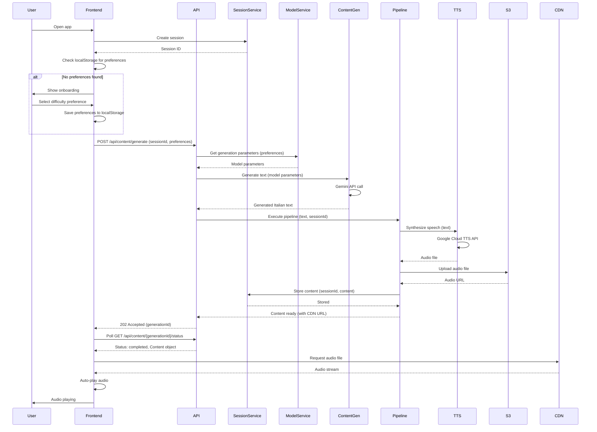
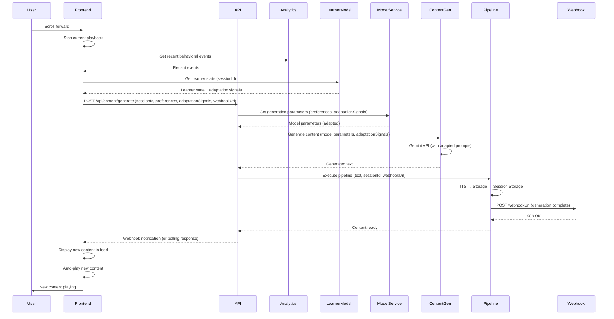
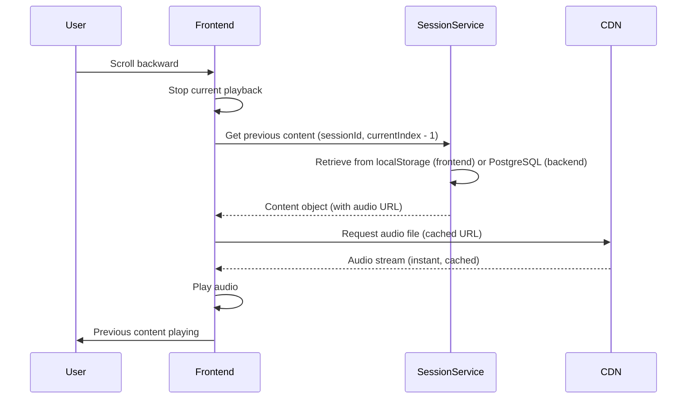
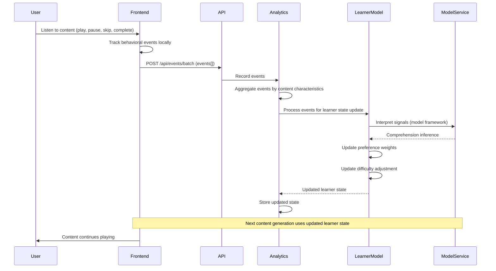
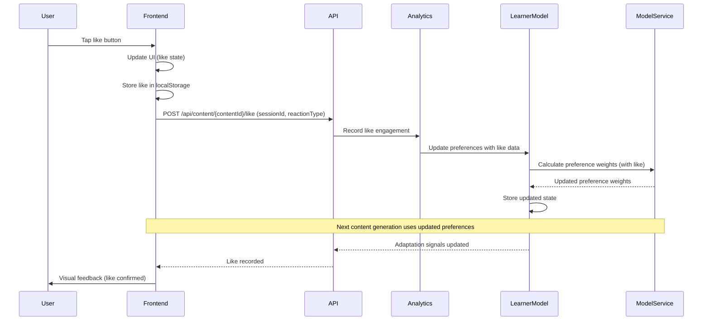
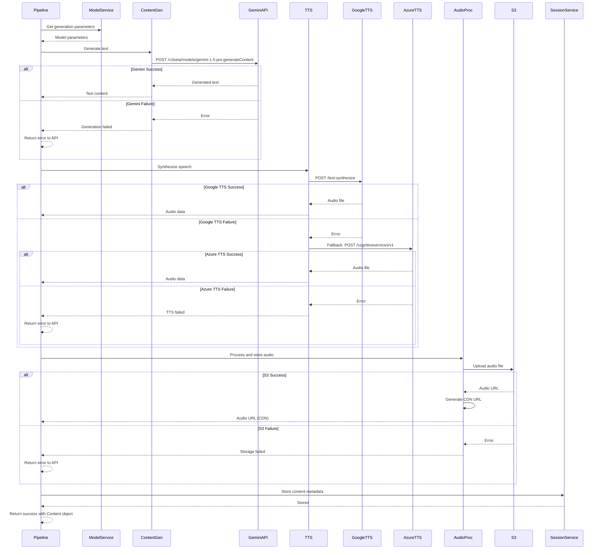

# Core Workflows

Key system workflows illustrating component interactions for critical user journeys and system operations.

## Workflow 1: First-Time User Onboarding & Initial Content Generation

**User Journey:** User opens app for first time, completes onboarding, receives first generated content.

## Workflow 2: Scroll Forward - Generate New Content

**User Journey:** User scrolls forward to generate new content, system generates content on-demand with model-driven adaptation.

## Workflow 3: Scroll Backward - Access Session History

**User Journey:** User scrolls backward to access previously generated content from current session.

## Workflow 4: Behavioral Event Tracking & Model-Driven Adaptation

**User Journey:** User listens to content, system tracks behavior, updates learner model, and adapts next content generation.

## Workflow 5: Like Engagement & Immediate Adaptation

**User Journey:** User likes content, system immediately incorporates like data into adaptation for next content.

## Workflow 6: Content Generation Pipeline with Error Handling

**System Operation:** Complete content generation pipeline with error handling and fallback mechanisms.

---

