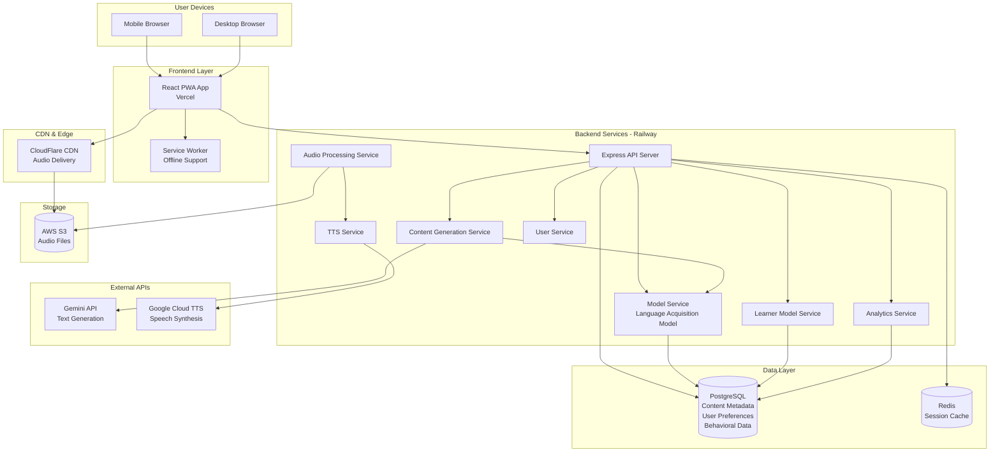

# High Level Architecture


## Technical Summary

The Adaptive Italian Audio application is built as a modular monolith using a Turborepo monorepo structure, optimized for rapid development and future scalability. The frontend is a React-based Progressive Web App (PWA) with TypeScript and Tailwind CSS, designed for mobile-first responsive consumption. The backend consists of Node.js/Express services with TypeScript, including a centralized Model Service that operationalizes the foundation language acquisition model. The system integrates with external AI APIs (Google Gemini for text generation, Google Cloud TTS for audio conversion) and uses PostgreSQL for structured data storage with Redis for session caching. The architecture supports asynchronous content generation pipelines, real-time behavioral tracking, and model-driven adaptation logic. Deployment uses a modern cloud platform (Vercel for frontend, Railway/Render for backend) with cloud storage (AWS S3 or Google Cloud Storage) for audio files and CDN delivery. The system is designed to operate within free-tier API limits for MVP scale while supporting model-driven content generation, adaptation, and measurement throughout.

## Platform and Infrastructure Choice

**Analysis of Options:**

Based on PRD v2 requirements, we need:
- Frontend hosting with PWA support
- Backend API hosting
- PostgreSQL database
- Cloud storage for audio files
- CDN for audio delivery
- Cost-effective for MVP (free-tier considerations)

**Option 1: Vercel + Railway/Render (Recommended)**
- **Frontend:** Vercel (optimized for React, automatic deployments, edge functions)
- **Backend:** Railway or Render (simple Node.js deployment, managed PostgreSQL)
- **Storage:** AWS S3 or Google Cloud Storage
- **CDN:** CloudFlare or Vercel Edge Network
- **Pros:** 
  - Excellent developer experience
  - Fast deployments
  - Good free tiers
  - Vercel optimized for React/Next.js
- **Cons:**
  - Multiple platforms to manage
  - Potential vendor lock-in

**Option 2: AWS Full Stack**
- **Frontend:** AWS Amplify or S3 + CloudFront
- **Backend:** AWS Lambda + API Gateway
- **Database:** RDS PostgreSQL
- **Storage:** S3
- **CDN:** CloudFront
- **Pros:**
  - Unified platform
  - Enterprise-grade scalability
  - Comprehensive services
- **Cons:**
  - More complex setup
  - Higher learning curve
  - More expensive for MVP

**Option 3: Google Cloud Platform**
- **Frontend:** Firebase Hosting or Cloud Run
- **Backend:** Cloud Run or Cloud Functions
- **Database:** Cloud SQL (PostgreSQL)
- **Storage:** Cloud Storage
- **CDN:** Cloud CDN
- **Pros:**
  - Good for ML/AI workloads (if we expand model service)
  - Integrated TTS service
- **Cons:**
  - More complex than needed for MVP
  - Higher setup overhead

**Recommendation:** **Option 1 - Vercel + Railway/Render**

**Rationale:**
- Best developer experience for rapid MVP development
- Vercel's React optimization aligns with frontend stack
- Railway/Render provide simple backend deployment with managed PostgreSQL
- Cost-effective free tiers suitable for MVP scale
- Easy to migrate to other platforms later if needed
- Separate concerns allow optimization per layer

**Selected Platform Configuration:**
- **Platform:** Vercel (Frontend) + Railway (Backend) ✓ **CONFIRMED**
- **Key Services:** 
  - Vercel: Frontend hosting, edge functions
  - Railway: Backend API, managed PostgreSQL, Redis
  - AWS S3: Audio file storage
  - CloudFlare: CDN for audio delivery
- **Deployment Host and Regions:** US-East (primary), with CDN for global distribution

## User Responsibilities & Setup Requirements

**CRITICAL:** The following setup tasks must be completed by the user before development can begin. These cannot be automated by development agents.

**External Service Account Creation (Required Before Epic 1):**

1. **Gemini API Access Setup (Google AI Studio):**
   - Enable Gemini API access via Google AI Studio at https://aistudio.google.com
   - Generate API key from account settings
   - Store API key securely for environment variable configuration
   - Verify API key has access to the chosen Gemini model (e.g. `gemini-1.5-pro`)
   - **User Action Required:** API access setup and API key generation

2. **Google Cloud TTS Service Setup:**
   - Create Google Cloud Platform account (or use existing)
   - Enable Text-to-Speech API in Google Cloud Console
   - Create service account for TTS API access
   - Generate service account JSON key file
   - Store JSON key file path for environment variable configuration
   - **User Action Required:** Account creation, API enablement, service account setup

3. **AWS S3 Storage Setup:**
   - Create AWS account (or use existing)
   - Create S3 bucket for audio file storage
   - Configure bucket policy for public read access (CDN access)
   - Create IAM user with S3 read/write permissions
   - Generate AWS Access Key ID and Secret Access Key
   - Store credentials securely for environment variable configuration
   - **User Action Required:** Account creation, bucket creation, IAM setup, credential generation

4. **CloudFlare CDN Setup (Post-Deployment):**
   - Create CloudFlare account (or use existing)
   - Add domain for CDN distribution
   - Configure S3 bucket as origin
   - Configure caching rules for audio files
   - **User Action Required:** Account creation, domain configuration, CDN setup

**Documentation Location:**
- Setup instructions for external services should be documented in project README.md
- Environment variable templates provided in `.env.example`
- Configuration guide in project documentation

**Rationale:**
External service account creation requires user authentication, payment setup, and service-specific configuration that cannot be automated by development agents. These must be completed by the user before any content generation or deployment workflows can function.

## Repository Structure

**Structure:** Monorepo using Turborepo

**Monorepo Tool:** Turborepo

**Package Organization:**
```
adaptive-italian-audio/
├── apps/
│   ├── web/                    # React frontend application
│   └── api/                    # Node.js/Express backend
├── packages/
│   ├── shared/                 # Shared TypeScript types and utilities
│   ├── model-service/          # Foundation language acquisition model service
│   └── config/                 # Shared configs (ESLint, TypeScript, etc.)
├── infrastructure/             # IaC definitions (if needed)
├── docs/                       # Documentation
└── turbo.json                  # Turborepo configuration
```

**Rationale:**
- Clear separation between frontend (apps/web) and backend (apps/api)
- Model service as separate package enables independent development and testing
- Shared package for common types ensures type safety across boundaries
- Config package centralizes tooling configuration
- Turborepo handles build orchestration and caching automatically

## High Level Architecture Diagram



## Architectural Patterns

- **Modular Monolith:** Service-oriented architecture within a single deployable unit, with clear service boundaries that can evolve into microservices if scaling demands it - _Rationale:_ Simplifies MVP development while maintaining separation of concerns, enables future migration path without refactoring

- **Progressive Web App (PWA):** Web application with service worker for offline capabilities and app-like experience - _Rationale:_ Supports lean-back mobile consumption, enables offline playback of cached content, provides native app-like experience without app store distribution

- **Model-Driven Architecture:** Centralized Model Service operationalizes foundation language acquisition model principles throughout the system - _Rationale:_ Ensures consistent application of model principles in content generation, adaptation, and measurement, enables model validation and refinement

- **Event-Driven Content Generation:** Asynchronous pipeline for content generation (text → TTS → storage) triggered by user scroll actions - _Rationale:_ Non-blocking user experience, supports on-demand generation, enables queue-based processing for API rate limit management

- **Repository Pattern:** Abstract data access layer separating business logic from database implementation - _Rationale:_ Enables testing with mock repositories, supports future database migration flexibility, maintains clean service boundaries

- **Session-Based State Management:** Frontend state management using React Context API with localStorage persistence - _Rationale:_ Lightweight for MVP, supports offline-first approach, enables session-based content navigation without backend complexity

- **Behavioral Signal Collection:** Passive event tracking system that collects user interaction data without explicit feedback - _Rationale:_ Aligns with model's emphasis on naturalistic measurement, enables model-driven adaptation without interrupting lean-back experience

- **Model-Informed Adaptation:** Content selection and difficulty adjustment driven by Model Service predictions based on behavioral signals - _Rationale:_ Operationalizes foundation model's adaptation principles, enables automatic personalization without manual configuration

---

