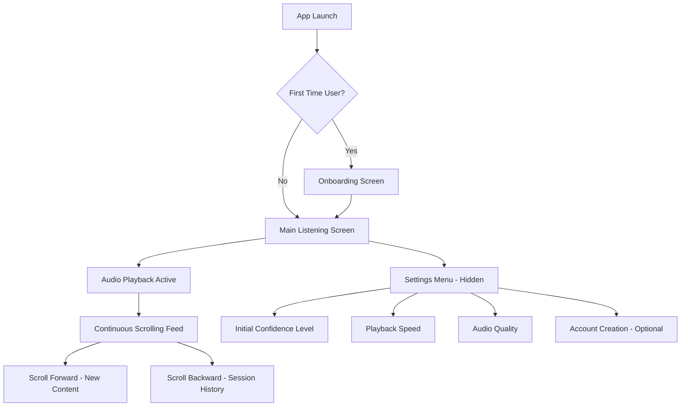
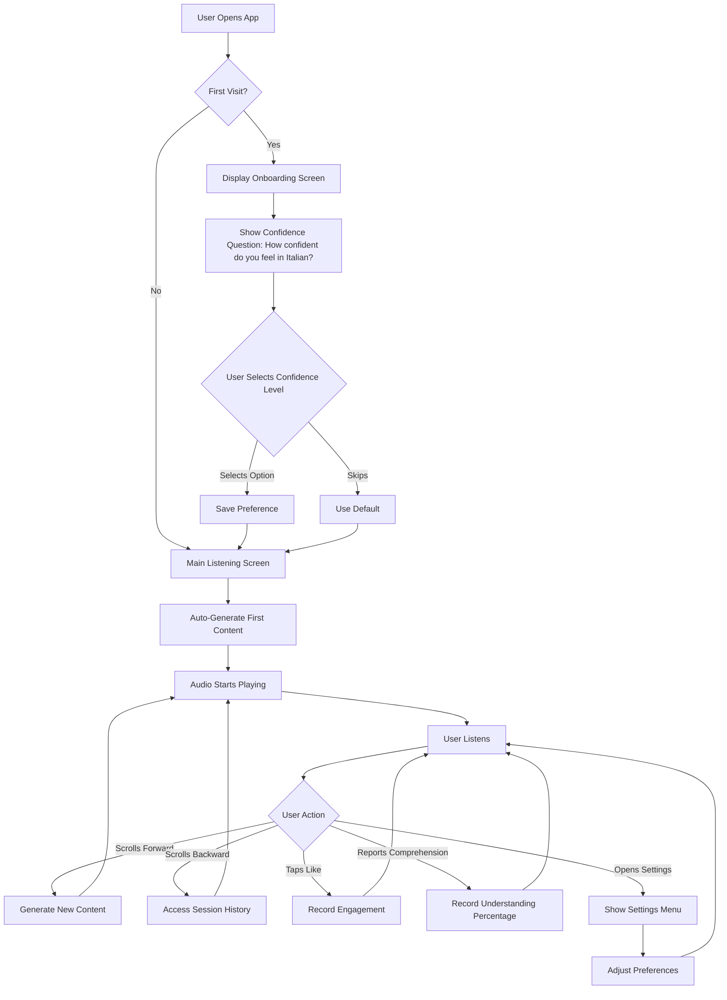
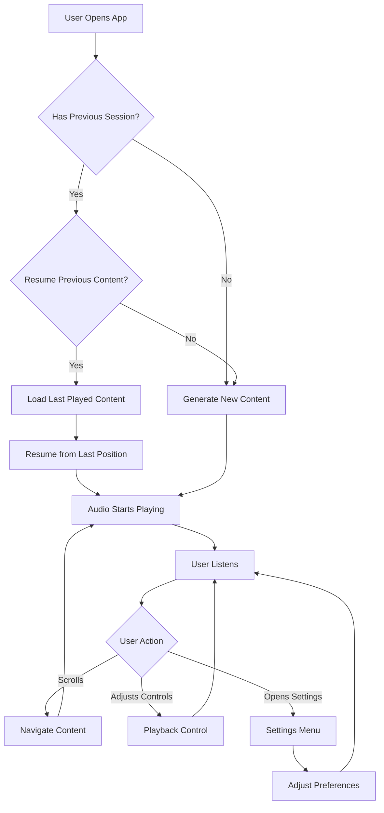

# Adaptive Italian Audio for Accelerated Acquisition UI/UX Specification

This document defines the user experience goals, information architecture, user flows, and visual design specifications for Adaptive Italian Audio for Accelerated Acquisition's user interface. It serves as the foundation for visual design and frontend development, ensuring a cohesive and user-centered experience.

## Overall UX Goals & Principles

### Target User Personas

**Primary Persona: Plateaued Intermediate Learner**
- **Demographic:** 25-45 years old, college-educated professionals in English-speaking countries
- **Current State:** 6 months to 3 years of Italian learning experience, understands basic grammar and vocabulary, struggles with natural-speed listening comprehension
- **Pain Points:** Content is either too easy (boring) or too hard (frustrating), can't access sufficient comprehensible input, feels "stuck" despite continued effort
- **Goals:** Break through intermediate plateau, achieve conversational fluency through naturalistic acquisition, maintain consistent exposure without feeling like work
- **Behavior:** Prefers media consumption over structured study, comfortable with lean-back listening during commutes/exercise, values narrative engagement

**Secondary Persona: Complete Beginner Seeking Immersion-First Approach**
- **Demographic:** 20-50 years old, varied occupations, minimal to no prior Italian experience
- **Current State:** Intimidated by native content, interested in immersion but needs foundational support
- **Pain Points:** Native content too difficult, traditional methods too grammar-heavy, beginner content feels disconnected from real Italian
- **Goals:** Build foundational comprehension through natural exposure, avoid grammar-heavy approaches, integrate learning into lifestyle
- **Behavior:** Regular audio content consumers, comfortable with passive consumption, value storytelling

### Usability Goals

- **Ease of learning:** New users can complete onboarding and start listening within 30 seconds, with zero learning curve for core listening experience
- **Efficiency of use:** Users can resume listening with a single tap/click—audio starts within 2 seconds of app launch
- **Error prevention:** No destructive actions available—users can't accidentally lose progress or break their experience
- **Memorability:** Interface is so minimal that infrequent users return without relearning—the app "disappears" as a tool
- **Engagement sustainability:** Design supports 30+ minute listening sessions through minimal interface friction and narrative pull
- **Invisible adaptation:** Difficulty adjustment occurs seamlessly with no visible indicators that might create performance anxiety

### Design Principles

1. **Clarity over cleverness** - Prioritize clear communication and immediate comprehension over aesthetic innovation
2. **Progressive disclosure** - Show only what's needed, when it's needed—audio controls appear on demand, settings hidden until needed
3. **Consistent patterns** - Use familiar media consumption patterns (podcast/audiobook interfaces) throughout the application
4. **Immediate feedback** - Every action (play, pause, skip) has instant, clear response—no loading states that break immersion
5. **Accessible by default** - Design for all users from the start, though MVP focuses on core functionality validation
6. **Meaning-first design** - Interface supports the foundation model's emphasis on meaning-focused processing—no grammar explanations or explicit instruction visible
7. **Lean-back first** - All interactions optimized for passive consumption—one-handed mobile use, screen-off playback support, minimal cognitive load

### Change Log

| Date | Version | Description | Author |
|------|---------|-------------|--------|
| 2026-01-07 | 1.0 | Initial UI/UX specification document | UX Expert |

## Information Architecture (IA)

### Site Map / Screen Inventory

**Screen Descriptions:**
- **App Launch:** Entry point that determines if onboarding is needed
- **Onboarding Screen:** Single, simple setup (30 seconds max) for initial confidence level assessment
- **Main Listening Screen:** Primary interface with audio player and continuous scrolling feed
- **Continuous Scrolling Feed:** Core interaction - bidirectional scrolling generates/accesses content
- **Settings Menu:** Hidden, accessible via unobtrusive menu icon
- **Content Queue/History:** Lightweight view (optional, minimal) for resuming specific episodes

### Navigation Structure

**Primary Navigation:** None (single-screen experience)
- The app functions as a single primary screen with auto-play on launch
- No traditional navigation menu or tabs
- Content discovery happens through scrolling, not navigation

**Secondary Navigation:** Minimal contextual controls
- **Audio Controls:** Always accessible but unobtrusive (play, pause, skip forward 15s, skip backward 15s)
- **Like Button:** Instagram-style heart icon for quick engagement feedback
- **Comprehension Percentage Button:** Button to report understanding level (0-100%) for each audio clip
- **Settings Access:** Hidden menu icon (hamburger or gear) in corner, reveals on tap
- **Content Metadata:** Current episode title and format indicator visible but minimal

**Breadcrumb Strategy:** Not applicable
- Single-screen design eliminates need for breadcrumbs
- Scrolling provides spatial context (forward = new, backward = previous)
- Current content position indicated by episode title/format, not breadcrumbs

## User Flows

### Flow 1: First-Time User Onboarding & Initial Listening

**User Goal:** Complete quick setup and start listening to Italian audio content immediately

**Entry Points:**
- User opens app for the first time (web browser or PWA)
- User arrives at app URL

**Success Criteria:**
- User completes onboarding in under 30 seconds
- Audio begins playing automatically within 2 seconds after onboarding
- User understands they can scroll to discover more content
- No confusion or friction in the initial experience

**Flow Diagram:**

**Edge Cases & Error Handling:**
- **Browser blocks auto-play:** Show clear visual cue (play button) to start playback manually
- **Slow network connection:** Show loading indicator during content generation, maintain user engagement
- **Content generation fails:** Display friendly error message, offer retry option
- **User closes app during onboarding:** Save partial progress, resume from same point on return
- **User skips onboarding entirely:** Use intelligent defaults based on any available signals
- **Comprehension percentage not reported:** System works without it—feedback is optional, adaptation uses other signals if percentage unavailable
- **User changes mind on percentage:** Allow percentage to be updated for current clip until new clip starts

**Notes:**
- Onboarding must be minimal—maximum 2-3 screens, completable in 30 seconds
- Auto-play is critical for "lean-back" experience—audio should start without user action
- First content generation happens automatically to demonstrate value immediately
- No account creation required for initial use—preferences stored in localStorage
- Confidence level question provides initial baseline only—actual content adaptation uses multi-dimensional difficulty assessment, not this single confidence value
- Comprehension percentage button allows users to report understanding for each clip—this feedback informs model-driven adaptation but is optional and non-intrusive

### Flow 2: Returning User Resume Listening

**User Goal:** Quickly resume listening from where they left off or start new content

**Entry Points:**
- User returns to app (bookmark, PWA icon, or URL)
- User opens app after closing it mid-session

**Success Criteria:**
- Audio starts playing within 2 seconds of app launch
- User can immediately continue listening without navigation
- Previous session state is preserved (if applicable)
- User feels continuity in their experience

**Flow Diagram:**

**Edge Cases & Error Handling:**
- **Session expired:** Gracefully start new session, don't show error
- **Previous content unavailable:** Generate new content automatically, no error message needed
- **Network unavailable:** Show cached content if available, otherwise friendly offline message
- **Browser auto-play blocked:** Show play button, maintain context

**Notes:**
- Returning users should experience zero friction—app "remembers" their state
- Auto-play on return maintains the "lean-back" experience
- No visible "resuming" or "loading" states—transitions should feel instant
- Preference for resuming vs. starting fresh can be inferred from behavior

## Wireframes & Mockups

### Primary Design Files

**Design Tool:** To be determined (Figma recommended for collaboration and handoff)

**Design File Location:** TBD - Design files will be created after this specification is approved

**Design System:** Will be established in Figma with component library, color tokens, and typography scales

### Key Screen Layouts

#### Screen 1: Main Listening Screen

**Purpose:** Primary interface where users spend 95% of their time—lean-back audio consumption with minimal visual distraction

**Key Elements:**
- **Large Audio Player Controls (Center):** Play/pause button (prominent, 60-80px), skip forward 15s, skip backward 15s buttons
- **Current Episode Title:** Large, elegant typography (24-32px), Italian text with optional English subtitle
- **Format Indicator:** Subtle badge showing content type (Narrative, Podcast, Educational)
- **Playback Progress:** Minimal progress bar (thin, elegant) showing current position and duration
- **Like Button:** Heart icon (Instagram-style) positioned unobtrusively, provides engagement feedback
- **Comprehension Percentage Button:** Button to report understanding level (0-100%) for current audio clip, positioned near like button
- **Settings Access:** Hidden menu icon (hamburger or gear) in top corner, reveals on tap
- **Background:** Subtle gradient or color theme matching content mood (optional, minimal to avoid distraction)
- **Scrolling Indicator:** Subtle visual cue showing scroll direction capability (optional, minimal)

**Interaction Notes:**
- Audio controls respond instantly (100ms target) to maintain immersion
- Scrolling forward/backward triggers content changes automatically
- Like button provides haptic feedback (mobile) or visual animation
- Comprehension percentage button opens quick selection interface (slider, buttons, or percentage picker)
- Comprehension feedback can be provided during or after listening to each clip
- Settings menu slides in from side or appears as overlay, doesn't break audio playback
- Screen supports one-handed mobile use—all critical controls within thumb reach
- Interface works with screen-off audio playback on mobile devices

**Design File Reference:** TBD - Main listening screen mockup will be created in Figma

#### Screen 2: Onboarding Screen

**Purpose:** Quick setup for first-time users to establish initial confidence level (baseline for content adaptation)

**Key Elements:**
- **Welcome Message:** Brief, warm greeting (1-2 sentences max)
- **Confidence Question:** "How confident do you feel in Italian?" with 4 options: Absolute beginner, Beginner, Intermediate, Advanced
- **Skip Option:** Clear "Skip" or "Start Listening" button for users who want to begin immediately
- **Minimal Branding:** App name/logo subtle, doesn't dominate screen
- **Progress Indicator (Optional):** Single dot or "Step 1 of 1" if multiple screens, otherwise omit

**Interaction Notes:**
- Maximum 2-3 screens total, completable in 30 seconds
- Large, tappable buttons for mobile use
- Selection immediately saves preference, no confirmation needed
- Auto-advances to main listening screen after selection or skip
- No account creation or email collection—pure preference setup

**Design File Reference:** TBD - Onboarding flow mockup will be created in Figma

#### Screen 3: Settings Menu (Hidden/Overlay)

**Purpose:** Access to user preferences and optional account creation, hidden until needed

**Key Elements:**
- **Initial Confidence Level Adjustment:** Same options as onboarding (Absolute beginner, Beginner, Intermediate, Advanced), allows users to change their initial confidence assessment
- **Playback Speed Control:** Slider or buttons for 0.75x, 1x, 1.25x, 1.5x speeds (if supported)
- **Audio Quality Setting:** Option to adjust quality for bandwidth considerations (if supported)
- **Account Creation (Optional):** Link to create account for cross-device sync (post-MVP feature)
- **Close/Dismiss Button:** Clear way to return to main listening screen
- **Minimal Design:** Clean list or card-based layout, doesn't overwhelm

**Interaction Notes:**
- Appears as overlay or slide-in panel, doesn't navigate away from main screen
- Audio continues playing in background (or pauses, user preference)
- Changes save automatically, no "Save" button needed
- Dismisses on tap outside menu area or close button
- Settings accessible from main screen via unobtrusive icon

**Design File Reference:** TBD - Settings menu mockup will be created in Figma

## Component Library / Design System

### Design System Approach

**Approach:** Build a minimal, custom design system optimized for the audio-first experience rather than adopting a full framework like Material Design or Ant Design.

**Rationale:**
- Full design systems include many components we don't need (tables, complex forms, data grids)
- Custom system allows us to optimize specifically for audio playback and minimal interface
- Faster load times with only necessary components
- Better alignment with "lean-back" aesthetic—no unnecessary UI patterns

**Foundation:**
- **Base Framework:** Tailwind CSS for utility-first styling and responsive design
- **Component Architecture:** React components with TypeScript for type safety
- **Design Tokens:** Custom color palette, typography scale, spacing system
- **Component Philosophy:** Minimal, focused components that support audio consumption

**Component Categories:**
1. **Audio Components:** Playback controls, progress indicators, audio player
2. **Content Components:** Episode cards, format badges, title displays
3. **Navigation Components:** Settings menu, overlay panels
4. **Feedback Components:** Like button, comprehension percentage button, loading states, error messages
5. **Form Components:** Onboarding confidence assessment, settings controls

### Core Components

#### Component 1: Audio Player

**Purpose:** Primary audio playback interface with controls optimized for one-handed mobile use

**Variants:**
- **Default:** Full player with all controls visible
- **Minimal:** Reduced controls for screen-off playback scenarios
- **Compact:** Smaller version for embedded contexts (future use)

**States:**
- **Idle:** Paused, ready to play
- **Loading:** Content generating or buffering
- **Playing:** Active playback with animated progress
- **Error:** Playback failure with retry option

**Usage Guidelines:**
- Always positioned prominently in center of main listening screen
- Controls must be large enough for thumb interaction (minimum 44x44px touch targets)
- Progress bar should be thin and elegant, doesn't dominate interface
- Skip buttons (15s forward/backward) positioned symmetrically around play/pause
- Visual feedback on all interactions (hover, active, pressed states)

#### Component 2: Episode Title Display

**Purpose:** Display current episode title and format information elegantly

**Variants:**
- **Primary:** Large title for main listening screen (24-32px)
- **Secondary:** Smaller title for history/list views (18-24px)
- **With Subtitle:** Italian title with optional English translation

**States:**
- **Default:** Static title display
- **Loading:** Skeleton or placeholder text during content generation
- **Truncated:** Long titles with ellipsis, full title on hover/tap

**Usage Guidelines:**
- Italian text should be prominent and readable
- Format indicator (badge) should be subtle, not competing with title
- Typography should feel elegant and media-focused, not educational
- Support for long titles with graceful truncation
- Consider line height and spacing for readability during listening

#### Component 3: Like Button

**Purpose:** Quick engagement feedback that informs model-driven adaptation

**Variants:**
- **Default:** Heart icon, unfilled state
- **Liked:** Heart icon, filled state with animation
- **Compact:** Smaller version for embedded contexts

**States:**
- **Unliked:** Outline heart icon
- **Liked:** Filled heart icon with color
- **Animating:** Brief animation on state change (scale, fill, or pulse)
- **Disabled:** During content generation or error states

**Usage Guidelines:**
- Instagram-style interaction pattern for familiarity
- Position unobtrusively, doesn't interfere with audio controls
- Haptic feedback on mobile devices when available
- Animation should be subtle and delightful, not distracting
- State persists during session, resets for new content

#### Component 4: Comprehension Percentage Button

**Purpose:** Allow users to report their understanding level (0-100%) for each audio clip, providing direct feedback for model-driven adaptation

**Variants:**
- **Default:** Button with percentage icon or "Understand?" label
- **With Value:** Shows last reported percentage (e.g., "75%")
- **Compact:** Smaller version for minimal interface

**States:**
- **Unreported:** No percentage recorded for current clip
- **Reported:** Percentage has been set, shows value
- **Active:** User is interacting with percentage selector
- **Disabled:** During content generation or error states

**Interaction Pattern:**
- **Trigger:** Tap/click button opens percentage selector
- **Selector Options:**
  - **Slider:** Continuous 0-100% slider (precise but requires more interaction)
  - **Quick Buttons:** Pre-set options (0%, 25%, 50%, 75%, 100%) for fast selection
  - **Percentage Picker:** Number input or dial for exact percentage
- **Selection:** User selects percentage, value saves automatically
- **Display:** Button shows selected percentage or icon until new clip starts

**Usage Guidelines:**
- Positioned near like button, unobtrusive but accessible
- Can be used during or after listening to each clip
- Percentage is specific to current audio clip—resets for new content
- Quick selection preferred over precise input to maintain lean-back experience
- Visual feedback on selection (confirmation animation or checkmark)
- Haptic feedback on mobile devices when available
- Button should clearly indicate it's for reporting comprehension, not a test
- **Important:** This is user-reported feedback that informs adaptation, not a test or assessment

#### Component 5: Settings Menu / Overlay

**Purpose:** Hidden access to user preferences and settings

**Variants:**
- **Slide-in Panel:** Slides in from side (mobile-friendly)
- **Modal Overlay:** Centered modal (desktop alternative)
- **Bottom Sheet:** Slides up from bottom (mobile alternative)

**States:**
- **Hidden:** Not visible, accessible via menu icon
- **Visible:** Overlay displayed with settings options
- **Transitioning:** Smooth animation during open/close

**Usage Guidelines:**
- Doesn't navigate away from main screen—overlay pattern
- Audio continues playing in background (or pauses based on user preference)
- Dismissible via close button, tap outside, or swipe gesture
- Settings save automatically, no "Save" button needed
- Minimal design—clean list or card-based layout

#### Component 6: Confidence Level Selector

**Purpose:** Allow users to set or adjust their initial confidence level in Italian (baseline for content adaptation)

**Variants:**
- **Button Group:** 4 large buttons (Absolute beginner, Beginner, Intermediate, Advanced)
- **Onboarding Version:** Full-width buttons for first-time setup
- **Settings Version:** Compact selection for settings menu

**States:**
- **Unselected:** No confidence level set, shows default
- **Selected:** Active confidence level highlighted
- **Disabled:** During content generation or error states

**Usage Guidelines:**
- Used in both onboarding and settings
- Large, tappable targets for mobile (minimum 44px height)
- Clear labels: "Absolute beginner", "Beginner", "Intermediate", "Advanced"
- Question text: "How confident do you feel in Italian?"
- Immediate save on selection—no confirmation needed
- Visual feedback on selection (highlight, checkmark, or color change)
- **Important:** This is an initial baseline setting only. The actual content adaptation system uses multi-dimensional difficulty assessment, not this single confidence level.

#### Component 7: Loading State Indicator

**Purpose:** Provide feedback during content generation without breaking immersion

**Variants:**
- **Skeleton Screen:** Placeholder content matching final layout
- **Spinner:** Minimal spinner for quick operations
- **Progress Indicator:** For longer operations (if timing is known)

**States:**
- **Active:** Content generating, show loading state
- **Complete:** Content ready, transition to actual content
- **Error:** Generation failed, show error state

**Usage Guidelines:**
- Keep loading states minimal and elegant—don't create anxiety
- Skeleton screens preferred over spinners for better perceived performance
- Loading should feel fast even if generation takes time
- Avoid "loading" text—visual indicators are sufficient
- Smooth transition from loading to content, no jarring changes

## Branding & Style Guide

### Visual Identity

**Brand Guidelines:** To be established—brand identity should evoke Italian culture, storytelling, and media consumption rather than language learning

**Brand Positioning:**
- **Primary Message:** "Personalized Italian audio experiences" (not "learn Italian")
- **Tone:** Confident, relaxed, immersive—feels like premium Italian media platform
- **Visual Feel:** Warm, inviting, sophisticated—elegant without being clichéd
- **Avoid:** Educational tool aesthetics, gamification elements, language learning app stereotypes

**Brand Elements:**
- Logo/wordmark to be designed (subtle, doesn't dominate interface)
- Color palette inspired by Italian culture but modern and accessible
- Typography that feels media-focused and elegant
- Visual language that supports "forget you're learning" principle

### Color Palette

| Color Type | Hex Code | Usage |
|------------|----------|-------|
| Primary | TBD | Main brand color, primary buttons, accents |
| Secondary | TBD | Supporting elements, secondary actions |
| Accent | TBD | Highlights, interactive elements, like button |
| Success | TBD | Positive feedback, confirmations |
| Warning | TBD | Cautions, important notices |
| Error | TBD | Errors, destructive actions |
| Neutral - Text | TBD | Primary text color, high contrast |
| Neutral - Text Secondary | TBD | Secondary text, subtitles |
| Neutral - Background | TBD | Main background color |
| Neutral - Surface | TBD | Cards, overlays, elevated surfaces |
| Neutral - Border | TBD | Borders, dividers, subtle separators |

**Color Considerations:**
- Palette should evoke Italian warmth (consider terracotta, olive, Mediterranean blues) while remaining modern
- Ensure sufficient contrast for readability (WCAG AA minimum)
- Support both light and dark mode (if dark mode is implemented)
- Colors should not distract from audio content—subtle and sophisticated

### Typography

#### Font Families

- **Primary:** TBD - Elegant, readable serif or sans-serif (consider Italian-inspired but modern)
- **Secondary:** TBD - Supporting font for UI elements
- **Monospace:** TBD - Code or technical displays (if needed)

**Font Selection Criteria:**
- Excellent readability at various sizes
- Supports Italian characters and diacritics
- Web-safe or easily loadable (performance consideration)
- Feels premium and media-focused, not educational

#### Type Scale

| Element | Size | Weight | Line Height | Usage |
|---------|------|--------|-------------|-------|
| H1 | TBD | TBD | TBD | Main episode titles, hero text |
| H2 | TBD | TBD | TBD | Section headings, large titles |
| H3 | TBD | TBD | TBD | Subsection headings |
| Body | TBD | TBD | TBD | Primary content, descriptions |
| Small | TBD | TBD | TBD | Metadata, captions, secondary info |
| Button | TBD | TBD | TBD | Button text, interactive elements |

**Typography Guidelines:**
- Italian text should be prominent and elegant (24-32px for main titles)
- Line height should support comfortable reading during listening
- Font weights should create clear hierarchy without being heavy
- Typography should feel sophisticated, not playful or educational

### Iconography

**Icon Library:** TBD - Consistent icon set (consider Feather Icons, Heroicons, or custom set)

**Icon Style:**
- Minimal, line-based icons preferred
- Consistent stroke width throughout
- Icons should be recognizable at small sizes (minimum 24px)
- Support for filled and outline variants (like button, play/pause states)

**Usage Guidelines:**
- Use icons sparingly—only when they add clarity
- Audio controls: play, pause, skip forward, skip backward
- Navigation: settings menu, close/dismiss
- Feedback: like/heart, comprehension percentage, loading spinner
- Icons should be accessible (sufficient size, clear meaning)

### Spacing & Layout

**Grid System:** TBD - Responsive grid system (consider 12-column or 8px base grid)

**Spacing Scale:** TBD - Consistent spacing scale based on 4px or 8px base unit

**Spacing Guidelines:**
- Generous spacing around audio controls for thumb interaction
- Comfortable padding in cards and overlays
- Consistent margins between sections
- Mobile-first spacing that scales appropriately for larger screens

**Layout Principles:**
- Center-aligned content for main listening screen
- Generous whitespace to reduce visual clutter
- Content should breathe—avoid cramped layouts
- Responsive breakpoints for mobile, tablet, desktop

## Accessibility Requirements

### Compliance Target

**Standard:** WCAG 2.1 Level AA (target for MVP validation phase)

**Note:** MVP focuses on core functionality validation. Full accessibility implementation may be prioritized in Phase 2 once core value proposition is proven. However, accessibility considerations should be incorporated from the start where feasible.

### Key Requirements

**Visual:**
- Color contrast ratios: Minimum 4.5:1 for normal text, 3:1 for large text (WCAG AA)
- Focus indicators: Visible focus states for all interactive elements (keyboard navigation)
- Text sizing: Support for browser text scaling up to 200% without breaking layout
- Color independence: Information conveyed through color must also be available through other means (icons, text)

**Interaction:**
- Keyboard navigation: All interactive elements accessible via keyboard (Tab, Enter, Space, Arrow keys)
- Screen reader support: Semantic HTML, ARIA labels where needed, proper heading structure
- Touch targets: Minimum 44x44px for all interactive elements (mobile accessibility)
- Focus management: Logical tab order, focus trapping in modals/overlays

**Content:**
- Alternative text: Descriptive alt text for icons and images (if any)
- Heading structure: Proper h1-h6 hierarchy for screen readers
- Form labels: All form inputs have associated labels
- Error messages: Clear, descriptive error messages that identify the issue

**Audio-Specific:**
- Audio controls: All playback controls must be keyboard accessible
- Audio descriptions: Consider providing transcripts or summaries (future enhancement)
- Playback state: Screen reader announces playback state changes (playing, paused, stopped)

### Testing Strategy

**Automated Testing:**
- Color contrast checking tools (WebAIM Contrast Checker, axe DevTools)
- Keyboard navigation testing (Tab through all interactive elements)
- Screen reader testing (NVDA, JAWS, VoiceOver)

**Manual Testing:**
- Test with keyboard-only navigation
- Test with screen readers on different platforms
- Test with browser zoom at 200%
- Test with color blindness simulators
- Test touch target sizes on actual mobile devices

**Future Enhancements (Post-MVP):**
- Full WCAG 2.1 Level AAA compliance
- Customizable font sizes
- High contrast mode
- Reduced motion preferences
- Audio transcripts for all content

## Responsiveness Strategy

### Breakpoints

| Breakpoint | Min Width | Max Width | Target Devices |
|------------|-----------|-----------|----------------|
| Mobile | 320px | 767px | Smartphones (primary target) |
| Tablet | 768px | 1023px | Tablets, small laptops |
| Desktop | 1024px | 1439px | Desktop browsers, large laptops |
| Wide | 1440px | - | Large desktop monitors |

**Breakpoint Rationale:**
- Mobile-first approach aligns with primary use case (commutes, exercise, downtime)
- Tablet breakpoint supports users who prefer larger screens for extended listening
- Desktop breakpoint ensures good experience on traditional computers
- Wide breakpoint prevents content from becoming too spread out on large monitors

### Adaptation Patterns

**Layout Changes:**
- **Mobile:** Single column, full-width audio player, stacked controls
- **Tablet:** Slightly wider layout, more generous spacing, side-by-side elements where appropriate
- **Desktop:** Centered content with max-width constraint, optimized for larger screens
- **Wide:** Maintain centered layout, prevent excessive width

**Navigation Changes:**
- **Mobile:** Bottom sheet or slide-in panels for settings, thumb-friendly controls
- **Tablet:** Side panels or overlays, larger touch targets
- **Desktop:** Modal overlays, hover states for interactive elements, mouse-optimized interactions

**Content Priority:**
- **Mobile:** Audio controls and current episode title are primary, other elements secondary
- **Tablet:** More content visible, better use of horizontal space
- **Desktop:** Full content display, optimized spacing and typography

**Interaction Changes:**
- **Mobile:** Touch-optimized, large tap targets (44px minimum), swipe gestures
- **Tablet:** Touch with optional mouse support, larger interactive areas
- **Desktop:** Mouse-optimized, hover states, keyboard shortcuts (future enhancement)
- **All:** Audio playback consistent across all devices

**Audio Player Adaptation:**
- **Mobile:** Large, thumb-accessible controls, full-width player
- **Tablet:** Slightly larger controls, optimized spacing
- **Desktop:** Centered player with max-width, maintains large controls for accessibility

## Animation & Micro-interactions

### Motion Principles

**Core Principles:**
- **Purposeful Motion:** Every animation serves a function—feedback, state change, or spatial orientation
- **Subtle and Fast:** Animations should be quick (200-300ms) and subtle, not distracting from audio
- **Performance First:** Animations must not impact audio playback or overall performance
- **Respect Preferences:** Honor user's reduced motion preferences (prefers-reduced-motion media query)
- **Delightful, Not Distracting:** Micro-interactions enhance experience but don't compete with audio content

**Animation Philosophy:**
- Support the "lean-back" experience—animations should feel effortless
- Provide clear feedback for user actions without breaking immersion
- Use motion to guide attention subtly, not aggressively
- Avoid animations that might cause motion sickness or distraction

### Key Animations

- **Play/Pause State Change:** Smooth icon transition (scale or fade, 200ms), provides clear feedback
- **Like Button Animation:** Heart fill animation with subtle scale (250ms), haptic feedback on mobile
- **Comprehension Percentage Selection:** Smooth transition when percentage is set (200ms), confirmation feedback
- **Content Transition:** Fade or slide when switching between audio clips (300ms), maintains continuity
- **Settings Menu Open/Close:** Slide-in or fade overlay (250ms), doesn't interrupt audio playback
- **Loading State:** Skeleton screen fade-in (200ms), smooth transition to content (300ms)
- **Button Press Feedback:** Subtle scale down on press (100ms), scale up on release (150ms)
- **Scroll Feedback:** Subtle visual indicator for scroll direction (optional, minimal)

**Animation Timing:**
- **Fast Interactions:** 100-200ms (button presses, state changes)
- **Moderate Transitions:** 200-300ms (content changes, menu animations)
- **Slow Transitions:** 300-500ms (major state changes, page transitions)

**Easing Functions:**
- **Ease-out:** For most UI animations (feels natural, responsive)
- **Ease-in-out:** For content transitions (smooth, balanced)
- **Linear:** For progress indicators (consistent, predictable)

**Performance Considerations:**
- Use CSS transforms and opacity for animations (GPU-accelerated)
- Avoid animating layout properties (width, height, top, left)
- Limit simultaneous animations to prevent jank
- Test animations on lower-end devices
- Provide reduced motion option for accessibility

## Performance Considerations

### Performance Goals

- **Page Load:** Initial app load under 2 seconds on 3G connection
- **Time to Interactive:** App becomes interactive within 2.5 seconds
- **Audio Start:** Audio begins playing within 2 seconds of app launch (including content generation)
- **Interaction Response:** All UI interactions respond within 100ms
- **Animation FPS:** Maintain 60fps for all animations, no jank
- **Content Generation:** Perceived performance—show loading state immediately, generate in background

### Design Strategies

**Lazy Loading:**
- Load audio content on-demand as user scrolls
- Defer non-critical assets (icons, images) until needed
- Progressive enhancement—core functionality works without all assets

**Optimized Assets:**
- Minimize font file sizes (subset fonts, use variable fonts if possible)
- Compress images (if any) with modern formats (WebP, AVIF)
- Optimize icon usage (SVG sprites, icon fonts, or inline SVG)

**Caching Strategy:**
- Service Worker caches static assets (CSS, JS, fonts)
- Cache generated audio content for session duration
- localStorage for user preferences and session state

**Progressive Enhancement:**
- Core audio playback works without JavaScript (fallback)
- Graceful degradation for older browsers
- Feature detection for advanced capabilities

**Content Generation Optimization:**
- Show skeleton screens immediately (perceived performance)
- Generate content in background without blocking UI
- Queue content generation requests efficiently
- Provide clear loading feedback without creating anxiety

**Network Considerations:**
- Optimize for slow connections (3G minimum target)
- Show cached content when available
- Graceful handling of network failures
- Offline support for cached content (PWA capabilities)

## Next Steps

### Immediate Actions

1. **Design Exploration:** Create visual design mockups in Figma based on this specification
2. **Brand Development:** Establish color palette, typography, and visual identity
3. **Component Development:** Begin building React components based on component library specifications
4. **User Testing:** Validate onboarding flow and main listening screen with target users
5. **Accessibility Audit:** Review design mockups for accessibility compliance
6. **Performance Planning:** Establish performance budgets and monitoring strategy

### Design Handoff Checklist

- [ ] All user flows documented and validated
- [ ] Component inventory complete with specifications
- [ ] Accessibility requirements defined and incorporated
- [ ] Responsive strategy clear with breakpoints established
- [ ] Brand guidelines incorporated into design system
- [ ] Performance goals established and measurable
- [ ] Animation principles defined and documented
- [ ] Design files created in Figma with component library
- [ ] Design tokens (colors, typography, spacing) documented
- [ ] Interaction patterns specified for all components
- [ ] Edge cases and error states designed
- [ ] Mobile, tablet, and desktop layouts created

### Design-to-Development Handoff

**Deliverables:**
- Figma design files with component library
- Design tokens exported (colors, typography, spacing)
- Interaction specifications for complex components
- Animation timing and easing documentation
- Responsive breakpoint specifications
- Accessibility annotations and requirements

**Collaboration Points:**
- Review component specifications with development team
- Validate technical feasibility of design decisions
- Establish design system implementation approach
- Plan for design iteration based on development feedback

### Open Questions & Decisions Needed

1. **Brand Identity:** Finalize color palette, typography choices, and logo design
2. **Animation Library:** Determine if custom animations or library (Framer Motion, etc.) will be used
3. **Icon System:** Choose icon library or create custom icon set
4. **Dark Mode:** Determine if dark mode will be supported in MVP or deferred
5. **Comprehension Percentage UI:** Finalize interaction pattern (slider vs. quick buttons vs. picker)
6. **Accessibility Priority:** Determine which accessibility features are MVP vs. Phase 2
7. **Performance Monitoring:** Establish tools and metrics for performance tracking

### Recommendations

1. **Start with Mobile:** Design and develop mobile experience first, then adapt for larger screens
2. **Iterate on Onboarding:** Test onboarding flow early and often—it's critical for first impression
3. **Prototype Audio Experience:** Create interactive prototype to validate audio-first approach
4. **User Testing:** Conduct usability testing with target personas before full development
5. **Accessibility Early:** Incorporate accessibility from the start rather than retrofitting
6. **Performance Budget:** Establish and monitor performance budgets throughout development
7. **Design System Evolution:** Plan for design system to evolve as features are added

---

**Document Status:** This UI/UX specification is a **living document** and should be updated as:
- Design decisions are finalized (colors, typography, components)
- User testing reveals improvements needed
- Technical constraints become clearer
- Brand identity is established
- Accessibility requirements are refined
- Performance targets are validated or adjusted
